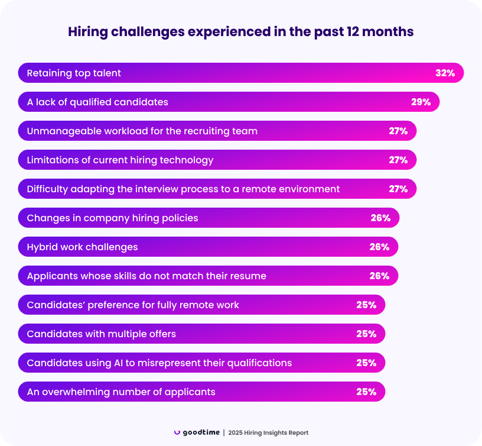
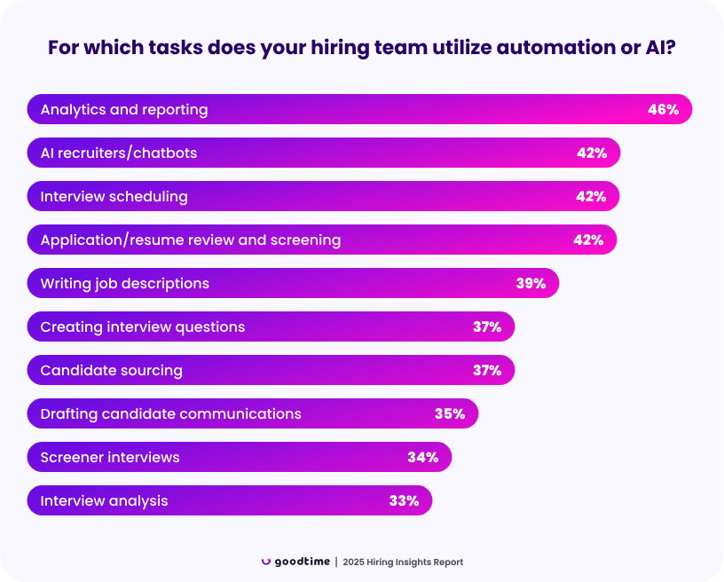
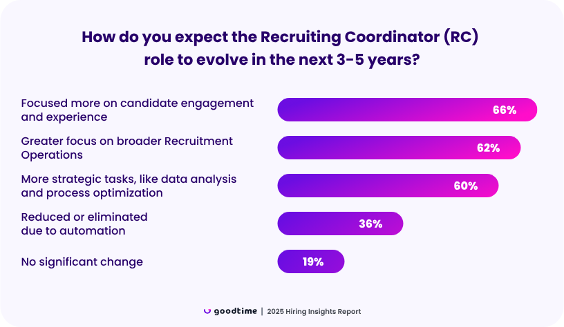

# Lý do chọn đề tài

- Sau covid, tất cả công việc giảm xuống (đây là thực trạng đang diễn ra)

- Theo khảo sát của [Havard](https://www.hbs.edu/managing-the-future-of-work/Documents/research/hiddenworkers09032021.pdf) và [Josh Bersin](https://joshbersin.com/2022/04/reccruiting-is-harder-than-it-looks-74-of-companies-underperform/), 74% các công ty tốn nhiều tài nguyên tìm kiếm ứng viên hơn mặc dù số lượng công việc lại tăng lên (người thất nghiệp, tìm kiếm công việc nhiều, nhưng thực trạng lại nói lên rằng khó khăn trong việc tìm kiếm ứng viên hơn)

- Retaining top talent remained the most significant challenge for TA teams in 2024, as competition for skilled employees intensified. However, limitations in hiring technology were also a top concern, continuing a trend identified in previous years’ reports. Many teams cited outdated or insufficient tools as barriers to scaling hiring operations effectively, often leading to increased manual workloads and process inefficiencies

- In this thesis, we focus on the challenges faced by Talent Acquisition (TA) teams, particularly in the context of hiring technology limitations and the inefficiencies that arise from manual processes. The goal is to explore how AI can be leveraged to automate these manual tasks, thereby improving the overall efficiency of the hiring process

- AI adoption is transforming how TA teams tackle persistent hiring challenges like inefficiency and administrative burdens. By automating repetitive tasks—such as interview scheduling, application screening, and reporting. Teams have freed up valuable time to focus on strategic priorities, like engaging high-value candidates

- Responsibility will shift focus towards candidate engagement and stategic decision-making, rather than administrative tasks

- Một trong những lý do là không hiệu quả trong toàn bộ quá trình (applicant sourcing, CV screening) => dẫn đến ý tưởng nếu con người làm không hiệu quả do có quá nhiều manual work, có thể dùng AI để tự động hoá những cái manual work đó
- Yếu tố con người sẽ được thêm vào xuyên suốt quá trình chạy của hệ thống để feedback và tinh chỉnh, khôgn còn là người ra quyết định cuối cùng

> "I foresee talent acquisition really uplifting, so they're not going to be recruiters, sourcers, and coordinators, but more of like talent advisors. Everyone's going to be saying, ‘hey, here's how to hire, here's the strategy, here's what we need to do, here's how we do it’ versus ‘Great, hiring manager, I will go find this for you.’"
> Said Megan Hennessy, Former Global Senior Talent Leader at Meta
