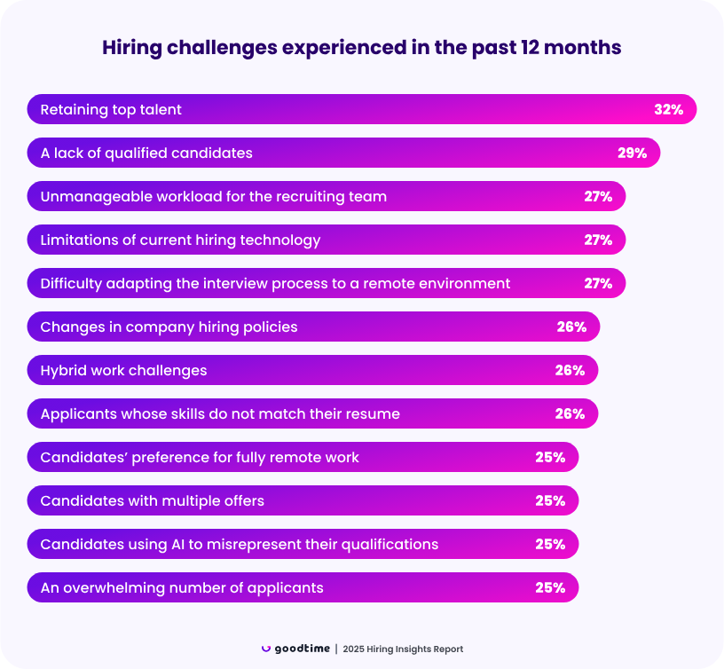
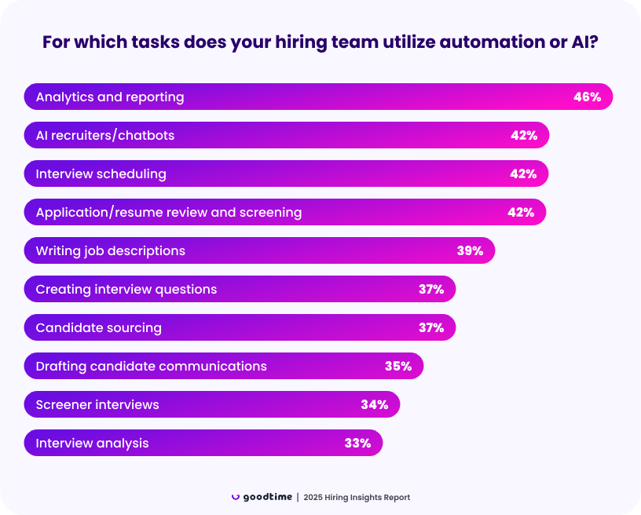
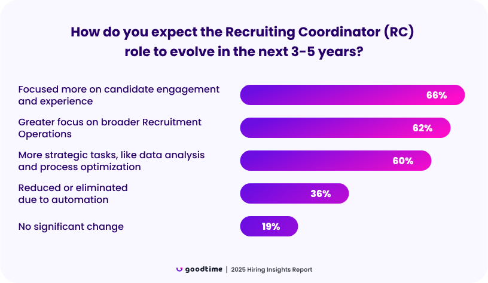

# Chương 1: Giới thiệu

## 1.1. Lý do chọn đề tài

Bối cảnh kinh tế - xã hội toàn cầu đã trải qua những biến đổi sâu sắc sau đại dịch COVID-19, tác động mạnh mẽ đến thị trường lao động. Một nghịch lý đáng chú ý đã xuất hiện: trong khi số lượng người tìm việc tăng lên do biến động kinh tế, các doanh nghiệp lại đối mặt với thách thức ngày càng lớn trong việc tuyển dụng nhân tài. Theo một khảo sát uy tín, có tới 74% các công ty cho biết họ phải tiêu tốn nhiều thời gian và nguồn lực hơn bao giờ hết để tìm kiếm ứng viên phù hợp¹. Tình trạng này cho thấy sự thiếu hiệu quả trong các quy trình tuyển dụng truyền thống, vốn đang phải vật lộn để xử lý một khối lượng lớn dữ liệu ứng viên nhưng lại không thể sàng lọc và xác định được những người phù hợp nhất.

Trong báo cáo "2025 Hiring Insights Report" của GoodTime², các đội ngũ Thu hút Nhân tài (Talent Acquisition - TA) đã chỉ ra rằng việc giữ chân nhân tài hàng đầu (32%) và sự thiếu hụt ứng viên chất lượng (29%) là những thách thức lớn nhất họ gặp phải trong 12 tháng qua. Đáng chú ý, những rào cản về công nghệ tuyển dụng (27%) và khối lượng công việc quá tải (27%) cũng là những mối quan tâm hàng đầu. Điều này khẳng định một xu hướng đã được ghi nhận trong nhiều năm: các công cụ tuyển dụng lỗi thời hoặc không đủ mạnh mẽ đang cản trở khả năng mở rộng quy mô hoạt động, dẫn đến việc gia tăng các tác vụ thủ công và làm quy trình trở nên kém hiệu quả.

Trước thực trạng đó, việc áp dụng Trí tuệ Nhân tạo (AI) và tự động hóa đang nổi lên như một giải pháp đột phá. Luận văn này tập trung vào việc giải quyết các thách thức mà đội ngũ TA phải đối mặt, đặc biệt là những hạn chế về công nghệ và sự kém hiệu quả phát sinh từ các quy trình thủ công. Mục tiêu là khám phá cách AI có thể được tận dụng để tự động hóa các công việc lặp đi lặp lại, từ đó giải phóng thời gian cho các chuyên viên tuyển dụng để họ tập trung vào các nhiệm vụ chiến lược hơn.

Thực tế cho thấy, AI đang dần thay đổi cách các đội ngũ TA giải quyết các vấn đề cố hữu. Bằng cách tự động hóa các tác vụ như lập lịch phỏng vấn, sàng lọc hồ sơ, và tạo báo cáo phân tích, công nghệ đã giúp các chuyên viên tuyển dụng có thêm thời gian để tập trung vào các ưu tiên chiến lược, chẳng hạn như tương tác và xây dựng mối quan hệ với các ứng viên tiềm năng giá trị cao.

Sự chuyển dịch này không chỉ giúp tối ưu hóa hiệu suất mà còn định hình lại vai trò của chính các chuyên viên tuyển dụng. Thay vì chìm ngập trong các công việc hành chính, vai trò của họ sẽ được nâng tầm, tập trung nhiều hơn vào việc tương tác với ứng viên, phân tích dữ liệu và tối ưu hóa quy trình. Tương lai của ngành tuyển dụng sẽ chứng kiến sự trỗi dậy của các "cố vấn nhân tài" (talent advisors) thay vì chỉ đơn thuần là những người tìm kiếm hay điều phối.

Như bà Megan Hennessy, cựu Trưởng phòng Nhân tài Cấp cao Toàn cầu tại Meta, đã nhận định:

"Tôi thấy trước sự nâng tầm thực sự của bộ phận thu hút nhân tài, họ sẽ không còn là những người tuyển dụng, tìm kiếm nguồn cung ứng và điều phối viên, mà giống như những cố vấn nhân tài hơn. Mọi người sẽ nói rằng, ‘này, đây là cách tuyển dụng, đây là chiến lược, đây là những gì chúng ta cần làm, đây là cách chúng ta thực hiện’ thay vì ‘Tuyệt vời, giám đốc tuyển dụng, tôi sẽ đi tìm người này cho ông.’"

Từ những phân tích trên, luận văn đề xuất xây dựng một hệ thống đa tác tử (multi-agent system) chuyên biệt cho lĩnh vực quản trị nhân sự (HRM), tập trung vào việc tự động hóa các khâu tốn nhiều công sức như tìm kiếm và sàng lọc ứng viên. Điểm cốt lõi của hệ thống này là cơ chế "con người trong vòng lặp" (human-in-the-loop), nơi yếu tố con người không bị loại bỏ mà được tích hợp xuyên suốt quá trình vận hành để đưa ra phản hồi, tinh chỉnh và giám sát, đảm bảo hệ thống hoạt động hiệu quả, minh bạch và phù hợp với chiến lược của tổ chức.

¹ Dựa trên các khảo sát từ [Harvard Business School](https://www.hbs.edu/ris/Publication%20Files/2020/May/19-062_05.pdf) và [Josh Bersin](https://joshbersin.com/2022/04/reccruiting-is-harder-than-it-looks-74-of-companies-underperform/).

² GoodTime. (2024). 2025 Hiring Insights Report.
