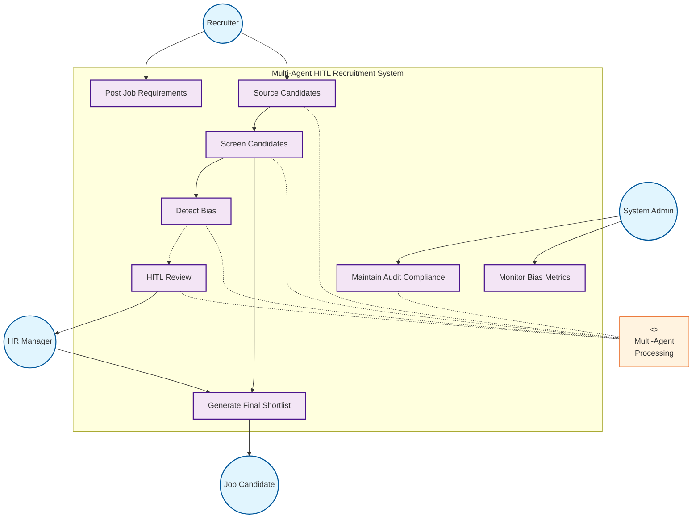
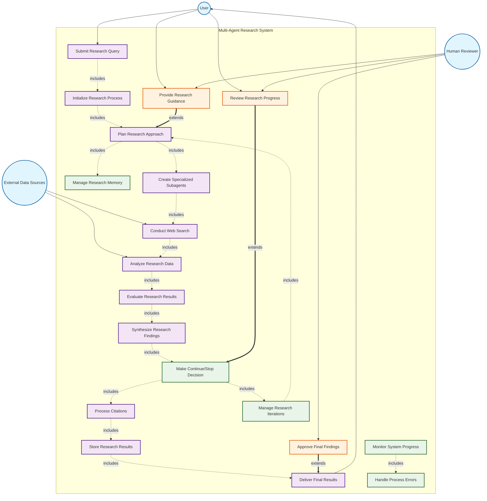
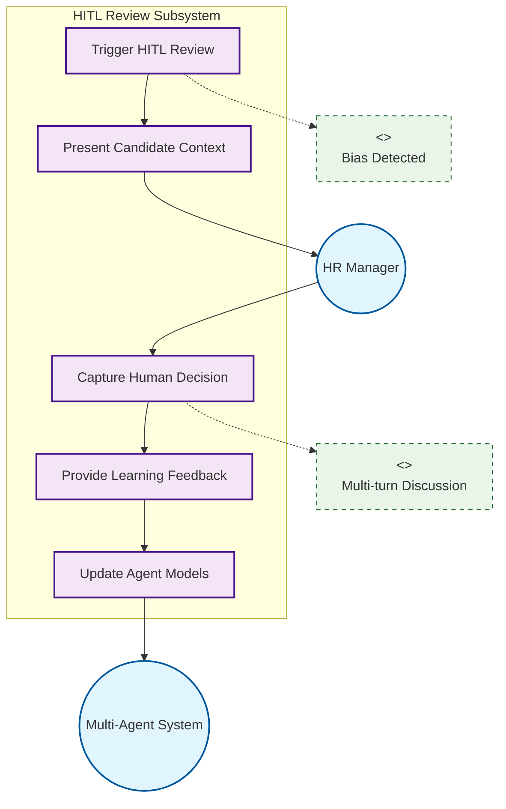
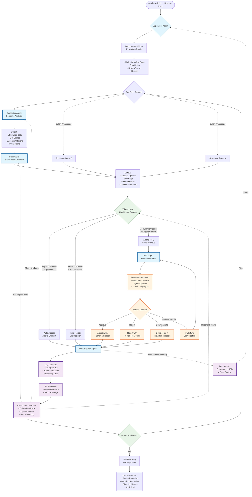

# Chapter 3: System Design

## 3.1 System Requirements

Goal:

- `P1` Enhanced recall: generate a ranked shortlist of candidates with better recall than baseline ATS
- `P1` Explanable decisions: provide an auditable, transparent recommendations via logging and human-in-the-loop
- `P3` Controlled workload: maintain reviewer load at small fraction of total pool (15-25%)

Principles:

- Layered intelligences: autonomous agents handle bulk processing, while human handle edge cases
- Feedback loop to improve over time

## 3.2 Use-case Overview

### System Actors

#### a. Primary Actors

- **Recruiter**: Initiates job postings, defines requirements, and oversees candidate sourcing
- **HR Manager**: Provides oversight, handles HITL reviews, and makes final hiring decisions
- **Job Candidate**: Submits applications and receives status updates
- **System Administrator**: Manages system configuration, user access, and compliance reporting

#### b. Multi-Agent System (Internal)

The system employs a collaborative multi-agent architecture that handles candidate sourcing, screening, bias detection, human-AI collaboration, and audit compliance autonomously. Individual agent responsibilities (described below) are detailed in the system architecture section.

### High-level Use Cases

Here I list the primary use cases for the multi-agent system.

#### 1. Job Management and Sourcing

- **Post Job Requirements**: Recruiter defines job criteria and evaluation rubric
- **Source Candidates**: Automated discovery from job boards, databases, and referrals
- **Manage Candidate Pool**: Deduplication, standardization, and eligibility filtering

#### 2. Candidate Screening and Evaluation

- **Screen Candidates**: Semantic analysis of resumes against job requirements
- **Detect Bias**: Critic agent reviews for discriminatory patterns
- **Generate Candidate Scores**: Evidence-based scoring with detailed rationales

#### 3. Human-in-the-Loop Review

- **Trigger HITL Review**: Automatic escalation based on confidence thresholds
- **Present Candidate Context**: Structured display of agent analysis and conflicts
- **Capture Human Decisions**: Record approvals, rejections, and feedback
- **Facilitate Multi-turn Discussion**: Support complex case clarification

#### 4. Decision Making and Compliance

- **Generate Final Shortlist**: Ranked candidates with decision rationales
- **Maintain Audit Trail**: Complete logging of agent decisions and human inputs
- **Monitor Bias Metrics**: Real-time diversity and fairness tracking
- **Continuous Learning**: Model improvement from human feedback

### Detailed Use Cases

### Human-in-the-loop (HITL) Use Cases

#### Scenario 1: Standard Screening Flow

**Actor**: Recruiter, Multi-Agent System

**Preconditions**: Job posted, candidate pool sourced

**Main Flow**:

- Multi-agent system analyzes candidate resumes against job rubric
- System performs independent bias assessment and validation
- If confidence high and analysis consistent, candidate auto-accepted/rejected
- System logs decision with complete rationale and audit trail

**Postconditions**: Candidate scored with audit trail

#### Scenario 2: HITL Intervention Required

**Actor**: HR Manager, Multi-Agent System

**Preconditions**: System uncertainty or potential bias detected

**Main Flow**:

- Multi-agent system escalates case to HR Manager
- System presents candidate context with analysis summary
- HR Manager reviews and makes decision
- Decision rationale captured for system learning
- Feedback updates system models and thresholds

**Extensions**:

- Multi-turn discussion if case requires clarification
- Bias flag escalation to compliance team

**Postconditions**: Human-validated decision with learning feedback

#### Scenario 3: Manual Candidate Addition

**Actor**: Recruiter, Job Candidate, Multi-Agent System

**Preconditions**: Active job posting, recruiter has candidate information

**Main Flow**:

- Recruiter manually adds candidate profile to system
- System validates profile data and requests missing information if needed
- Recruiter enriches profile with context notes and additional files
- System integrates candidate into sourcing pool with manual source tag
- Candidate enters standard screening workflow with enhanced context

**Extensions**:

- Candidate contacted directly for missing information
- Portfolio or work samples attached to profile
- Recruiter adds contextual notes about candidate background

**Postconditions**: Manually sourced candidate integrated into evaluation pipeline

## 3.3 Multi-Agent Architecture

### List of subagents

#### a. Supervisor agent (orchestrator)

**Role**: Central coordinator implementing supervisor-router pattern

**Responsibilities**:

- Decompose job descriptions into evaluation rubrics
- Route tasks between specialized agents
- Synthesize multi-agent outputs with conflict resolution
- Execute triage logic to control human review rate
- Generate final ranked shortlist

**Components**:

- Input: Job description, candidate pool, agent analysis results, human feedback
- Functionality: Workflow orchestration, requirement decomposition, conflict resolution, confidence scoring, triage decision-making
- Output: Evaluation rubrics, task routing decisions, final ranked shortlist with rationales
- Tools: Workflow orchestration engine, decision tree logic, scoring algorithms, message routing system, data aggregation tools
- Memory:
  - Short-term: Current workflow state, active candidate processing status, agent communication logs, real-time triage decisions
  - Long-term: Historical performance metrics, successful triage patterns, workflow optimization data, agent collaboration effectiveness
  - Permissions: Read/write access to all agent outputs, system-wide coordination data, workflow state management
  - Shared Plan: Overall workflow strategy, triage threshold parameters, agent task assignment protocols, performance optimization guidelines

#### 2. Sourcing subagent

**Role**: Multi-channel candidate sourcing and pool management

**Responsibilities**:

- Search and aggregate candidates from multiple recruitment sources
- Interface with job boards (LinkedIn, Indeed, Monster, etc.)
- Connect to internal talent databases and ATS systems
- Process manually added candidates from recruiters
- Standardize and deduplicate candidate profiles
- Maintain candidate sourcing metadata (source, date, channel)
- Filter candidates based on basic eligibility criteria

**Components**:

- Input: Job requirements, sourcing parameters, manual candidate uploads, external API data
- Functionality: Multi-channel search, data aggregation, profile standardization, deduplication, basic eligibility filtering
- Output: Standardized candidate pool with sourcing metadata and initial eligibility status
- Tools: Job board APIs, web scraping tools, database connectors, file upload interfaces, data validation engines, deduplication algorithms, search optimization tools
- Memory:
  - Short-term: Current search sessions, API rate limits, active sourcing queries, temporary candidate staging area
  - Long-term: Successful sourcing patterns, candidate source effectiveness metrics, historical search results, channel performance data
  - Permissions: Read access to job requirements and sourcing parameters, write access to candidate pool and sourcing metadata
  - Shared Plan: Sourcing strategy guidelines, target candidate profiles, channel priority rankings, search optimization techniques

#### 3. Screening subagent

**Role**: Initial semantic analysis of candidate-job fit

**Responsibilities**:

- Parse resumes (PDF/DOCX) into structured data
- Extract skills, experience, education with semantic understanding
- Score candidates against job requirements rubric
- Generate detailed rationale with evidence citations
- Output structured JSON with scores and justifications

**Components**:

- Input: Candidate resumes/profiles, evaluation rubric, job requirements
- Functionality: Document parsing, semantic analysis, skill extraction, requirement matching, evidence-based scoring
- Output: Structured candidate analysis with skill scores, experience mapping, and detailed rationales
- Tools: Document parsing engines, natural language processing models, semantic analysis tools, skill extraction algorithms, scoring frameworks, evidence citation systems
- Memory:
  - Short-term: Current candidate analysis sessions, parsing results, scoring calculations, temporary skill mappings
  - Long-term: Successful match patterns, skill recognition improvements, evaluation accuracy metrics, semantic model performance
  - Permissions: Read access to candidate data and evaluation rubrics, write access to analysis results and scoring data
  - Shared Plan: Screening criteria standards, scoring methodology frameworks, quality threshold definitions, semantic analysis protocols

#### 4. Critic subagent

**Role**: Second opinion to reduce false negatives

**Responsibilities**:

- Challenge screening decisions for bias and errors
- Identify "hidden gems" with transferable skills
- Flag potential discriminatory patterns
- Detect resume inconsistencies
- Provide contrarian analysis with specific examples

**Components**:

- Input: Screening agent results, original candidate data, evaluation rubric
- Functionality: Independent analysis, bias detection, alternative perspective generation, inconsistency checking
- Output: Second opinion scores, bias flags, hidden gem identification, confidence assessments
- Tools: Bias detection algorithms, pattern recognition engines, alternative analysis frameworks, inconsistency validators, transferable skills mappers, fairness auditing tools
- Memory:
  - Short-term: Current review cases, bias detection results, alternative analysis workbench, temporary contradiction flags
  - Long-term: Bias patterns database, successful correction history, hidden gem discovery patterns, fairness improvement metrics
  - Permissions: Read access to screening results and original candidate data, write access to bias flags and alternative assessments
  - Shared Plan: Bias detection strategies, alternative analysis frameworks, quality assurance protocols, fairness monitoring standards

#### 5. Human-in-the-loop (HITL) subagent

**Role**: Seamless human-AI collaboration interface

**Responsibilities**:

- Present ambiguous cases with clear context
- Display conflicting agent opinions side-by-side
- Capture human decisions with reasoning
- Support approve/reject/edit workflows
- Enable multi-turn clarification conversations

**Components**:

- Input: Ambiguous candidate cases, conflicting agent opinions, human interactions
- Functionality: Information presentation, decision capture, workflow facilitation, multi-turn conversation management
- Output: Human decisions with reasoning, corrected evaluations, clarification responses
- Tools: User interface frameworks, notification systems, decision capture forms, conversation management tools, workflow routing engines, real-time collaboration platforms
- Memory:
  - Short-term: Active human sessions, pending decisions, conversation context, real-time interaction state
  - Long-term: Human decision patterns, successful interaction flows, user preferences, reviewer performance analytics
  - Permissions: Read access to ambiguous cases and agent conflicts, write access to human feedback and decision overrides
  - Shared Plan: Human interaction protocols, escalation procedures, decision capture methodologies, user experience optimization guidelines

#### 6. Data-steward subagent

Role: Audit, privacy, and continuous improvement

**Responsibilities**:

- Maintain complete audit trails for compliance
- Anonymize PII before external API calls
- Collect structured feedback for model improvement
- Monitor bias metrics across demographic groups
- Generate training datasets from human corrections

**Components**:

- Input: All system interactions, agent decisions, human feedback, candidate data
- Functionality: Audit logging, privacy protection, bias monitoring, learning data collection, compliance tracking
- Output: Complete audit trails, anonymized datasets, bias metrics reports, training data for system improvement
- Tools: Audit logging systems, data anonymization engines, bias monitoring dashboards, compliance checkers, analytics platforms, data pipeline tools, privacy protection frameworks
- Memory:
  - Short-term: Current audit logs, active anonymization tasks, real-time monitoring alerts, temporary compliance checks
  - Long-term: Complete audit history, bias trend analysis, learning datasets archive, compliance records, system improvement metrics
  - Permissions: Read access to all system data and interactions, write access to audit logs and anonymized learning datasets
  - Shared Plan: Data governance policies, privacy protection protocols, bias monitoring frameworks, continuous learning improvement strategies

## Workflow Diagram

### Phase 1: Initialization (Supervisor Agent)

- Decomposes job description into structured evaluation criteria
- Extracts required skills, experience levels, qualifications
- Sets up workflow state management for tracking progress

### Phase 2: Parallel Screening (Multi-Agent Processing)

- Multiple screening agents process resumes concurrently
- Semantic analysis extracts structured data and initial scoring
- Load balancing across agent instances for scalability

### Phase 3: Critical Review (Bias Mitigation)

- Critic agent provides independent second opinion
- Identifies potential biases in screening decisions
- Flags "hidden gems" that may have been undervalued

### Phase 4: Intelligent Triage (Workload Control)

- Confidence scoring determines routing path
- Dynamic thresholds maintain review rate at small fraction (target: 15-25% to human review)
- Auto-decisions for clear cases, human review for ambiguous ones

### Phase 5: Human-in-the-Loop (Quality Assurance)

- Structured interface presents conflicting opinions
- Multiple interaction patterns: approve/reject/edit/clarify
- Captures not just decisions but reasoning for learning

### Phase 6: Continuous Learning (System Evolution)

- Data-Steward maintains complete audit trail
- Privacy protection through PII anonymization
- Feedback loops improve agent performance over time

## Human-in-the-Loop (HITL) Interaction

### Triage Criteria for Human Review:

- `|Screening_Score - Critic_Score|` > `disagreement_threshold`
- Confidence_Score < uncertainty_threshold
- Borderline candidates near acceptance boundary

### HITL Patterns:

- Approve/Reject: Standard review workflow
- Edit/Annotate: Corrective feedback for learning
- Multi-turn: Complex case discussions

## Evaluation Framework

### Primary Metrics

- Recall@K: |(System_Shortlist ∩ Gold_Standard)| / |Gold_Standard|
- False Negative Rate: Qualified candidates in reject pile
- Human Review Rate: Percentage requiring human evaluation

### Success Criteria

- Recall Improvement: >20% increase vs baseline ATS
- Audit Compliance: 100% traceable decisions
- Workload Control: Human review rate ≤ small fraction (15-25%)

### Validation Approach

- Gold standard datasets from expert recruiters
