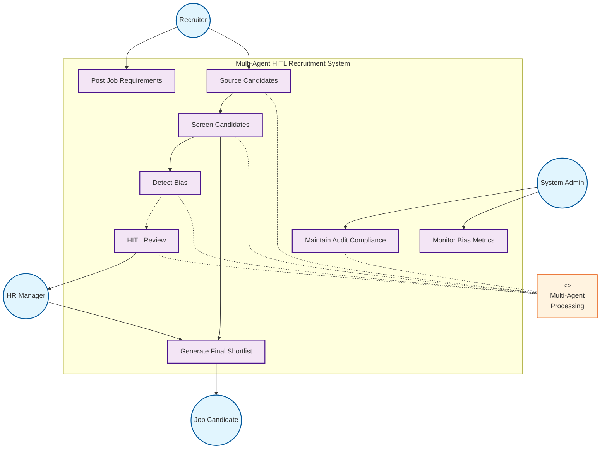
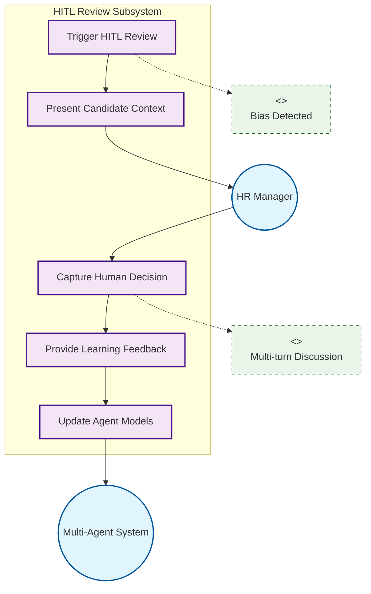

# Chapter 3: System Design

## 3.1 System Requirements

Goal:

- `P1` Enhanced recall: generate a ranked shortlist of candidates with better recall than baseline ATS
- `P1` Explanable decisions: provide an auditable, transparent recommendations via logging and human-in-the-loop
- `P3` Controlled workload: maintain reviewer load at small fraction of total pool (15-25%)

Principles:

- Layered intelligences: autonomous agents handle bulk processing, while human handle edge cases
- Feedback loop to improve over time

## 3.2 Use-case Overview

### 3.2.1 System Actors

#### Primary Actors (External)

- **Recruiter**: Initiates job postings, defines evaluation criteria, manages candidate sourcing, and provides contextual input for complex cases
- **HR Manager**: Provides oversight, handles HITL reviews for uncertain/high-stakes decisions, makes final hiring approvals, and guides bias mitigation strategies
- **Job Candidate**: Submits applications, receives status updates, and may be contacted for additional information
- **System Administrator**: Manages system configuration, user access controls, monitors compliance metrics, and generates audit reports

#### Secondary Actor

- **External Data Sources**: Job boards, professional networks, and candidate databases that provide candidate information

#### System Actor (Internal)

- **Multi-Agent System**: Autonomous collaborative framework consisting of specialized agents for (described in detail in Section 3.3):
  - Candidate sourcing and discovery
  - Resume screening and evaluation
  - Bias detection and mitigation
  - Human-AI collaboration coordination
  - Audit trail and compliance management

### 3.2.2 System Use Case Model

#### Core Use Case Categories

##### 1. Job Management and Sourcing

- **UC-JM-01: Post Job Requirements** - Recruiter defines job criteria, required skills, and evaluation rubric
- **UC-JM-02: Source Candidates** - System automatically discovers candidates from multiple sources
- **UC-JM-03: Manage Candidate Pool** - Deduplication, standardization, and eligibility filtering
- **UC-JM-04: Manual Candidate Addition** - Recruiter adds candidates with contextual notes

##### 2. Candidate Screening and Evaluation

- **UC-CS-01: Screen Candidates** - Semantic analysis of resumes against job requirements
- **UC-CS-02: Detect Bias** - Critic agent reviews screening decisions for discriminatory patterns
- **UC-CS-03: Generate Candidate Scores** - Evidence-based scoring with detailed rationales
- **UC-CS-04: Validate Decisions** - Cross-agent validation of screening outcomes

##### 3. Human-in-the-Loop (HITL) Review

- **UC-HITL-01: Trigger HITL Review** - Automatic escalation based on confidence thresholds or bias flags
- **UC-HITL-02: Present Candidate Context** - Structured display of agent analysis and conflicts
- **UC-HITL-03: Capture Human Decisions** - Record approvals, rejections, and feedback
- **UC-HITL-04: Facilitate Multi-turn Discussion** - Support iterative clarification for complex cases

##### 4. Decision Making and Compliance

- **UC-DM-01: Generate Final Shortlist** - Produce ranked candidates with transparent rationales
- **UC-DM-02: Maintain Audit Trail** - Complete logging of all decisions and interactions
- **UC-DM-03: Monitor Bias Metrics** - Real-time diversity and fairness tracking
- **UC-DM-04: Continuous Learning** - Model improvement from human feedback

#### Use Case Relationships

- **Includes**: UC-JM-01 includes UC-CS-01; UC-CS-01 includes UC-CS-02
- **Extends**: UC-HITL-01 extends UC-CS-01 when confidence is low; UC-HITL-04 extends UC-HITL-03 for complex cases
- **Generalizes**: UC-CS-03 generalizes to all evaluation contexts

### 3.2.3 Key Operational Scenarios

#### Primary Use Case Scenarios

| UC-ID    | Name                             | Primary Actor        | Pre-conditions                                                                                   | Main Steps                                                                                                                                                                                                                                                                                                                  | Post-conditions                                                                                                |
| -------- | -------------------------------- | -------------------- | ------------------------------------------------------------------------------------------------ | --------------------------------------------------------------------------------------------------------------------------------------------------------------------------------------------------------------------------------------------------------------------------------------------------------------------------- | -------------------------------------------------------------------------------------------------------------- |
| UC-OP-01 | Standard Automated Screening     | Multi-Agent System   | • Job requirements posted • Candidate pool sourced • Evaluation rubric defined             | 1. Retrieve candidate profiles from source pool 2. Analyze resumes against job rubric 3. Validate decisions via bias detection 4. Generate confidence scores and rationales 5. Process high-confidence decisions automatically 6. Send automated status updates to candidates 7. Log complete audit trail | • Candidates scored and categorized • Audit trail recorded • 70-80% processed without human intervention |
| UC-OP-02 | HITL Intervention for Edge Cases | HR Manager           | • Low confidence score (<0.7) • Bias flag raised • Agent disagreement detected             | 1. Detect uncertainty in evaluation 2. Escalate case with structured context 3. Present agent analyses and conflicts 4. Facilitate interactive discussion 5. Capture human decision and rationale 6. Update system models with feedback 7. Communicate decision to candidate                              | • Human-validated decision recorded • System learning updated • Complex case resolved                    |
| UC-OP-03 | Bias Detection and Mitigation    | System Administrator | • Bias patterns detected • Discrimination threshold exceeded • Compliance review triggered | 1. Identify potential discrimination patterns 2. Send alerts to HR Manager and Admin 3. Analyze historical decisions 4. Implement mitigation strategies 5. Re-evaluate affected candidates 6. Generate compliance report 7. Initiate ongoing monitoring                                                   | • Bias mitigation applied • Compliance documented • Monitoring activated                                 |

#### Supporting Use Case Scenarios

| UC-ID    | Name                       | Primary Actor | Pre-conditions                                                                             | Main Steps                                                                                                                                                                                                                                                                      | Post-conditions                                                                           |
| -------- | -------------------------- | ------------- | ------------------------------------------------------------------------------------------ | ------------------------------------------------------------------------------------------------------------------------------------------------------------------------------------------------------------------------------------------------------------------------------- | ----------------------------------------------------------------------------------------- |
| UC-OP-04 | Manual Candidate Addition  | Recruiter     | • Active job posting • Candidate information available • Recruiter has system access | 1. Add candidate profile manually 2. Validate profile completeness 3. Request missing information if needed 4. Enrich profile with context notes 5. Attach portfolio/work samples 6. Tag with manual source indicator 7. Route to standard screening workflow | • Candidate integrated into pool • Enhanced context preserved • Screening initiated |
| UC-OP-05 | Multi-turn HITL Discussion | HR Manager    | • Complex case flagged • Initial review incomplete • Clarification needed            | 1. Review initial case presentation 2. Request specific clarifications 3. System provides additional context 4. Iterative Q&A exchange 5. Reach informed decision 6. Document discussion thread 7. Finalize candidate status                                  | • Complex case clarified • Decision trail complete • Learning data captured         |

#### HITL Review Process Flow

## 3.3 Multi-Agent Architecture

### 3.3.1 Subagent Specifications

The multi-agent recruitment system operates through a distributed plan where six specialized agents collaborate to transform job requirements and candidate pools into ranked shortlists. Each agent contributes a distinct capability—sourcing discovers candidates, screening evaluates fit, critic validates decisions, HITL handles ambiguity, supervisor orchestrates workflow, and data-steward ensures compliance—while maintaining shared context and advancing toward the common goal of identifying qualified candidates with minimal bias and maximal transparency.

#### a. Supervisor Agent (Orchestrator)

**Role**: Central coordinator implementing supervisor-router pattern for multi-agent recruitment workflows.

**Core Responsibilities**: The supervisor decomposes job descriptions into evaluation rubrics, orchestrates task distribution across agents, and synthesizes their outputs while maintaining human review rates at 15-25% through intelligent triage.

**Plan Contribution**: Establishes the shared evaluation framework and orchestrates agent collaboration to achieve recruitment goals.

**Inputs/Outputs**: Job descriptions, candidate pools, agent analyses, human feedback → evaluation rubrics, routing decisions, ranked shortlists.

**Memory**: Ephemeral—workflow states, candidate processing status, communication logs. Persistent—performance metrics, triage patterns, optimization data. Permissions—full read/write access to all agent outputs and system coordination data.

#### b. Sourcing Subagent

**Role**: Multi-channel candidate discovery specialist building comprehensive candidate pools from external sources.

**Core Responsibilities**: The sourcing agent discovers and aggregates candidates from multiple channels, deduplicates profiles, and tracks metadata while applying initial eligibility filters.

**Plan Contribution**: Provides the raw candidate pool that feeds into screening and evaluation workflows.

**Inputs/Outputs**: Job requirements, sourcing parameters, manual uploads → standardized candidate pools with metadata.

**Memory**: Ephemeral—search sessions, API rate limits. Persistent—sourcing patterns, channel effectiveness metrics. Permissions—read access to job requirements, write access to candidate pools.

#### c. Screening Subagent

**Role**: Semantic analysis specialist evaluating candidate-job fit.

**Core Responsibilities**: The screening agent transforms unstructured resumes into scored assessments, extracting skills and experience to generate evidence-based evaluations with cited rationales.

**Plan Contribution**: Transforms unstructured candidate data into scored assessments that feed into triage decisions.

**Inputs/Outputs**: Resumes, evaluation rubrics, job requirements → structured analyses with scores and rationales.

**Memory**: Ephemeral—analysis sessions, scoring calculations. Persistent—match patterns, skill recognition improvements. Permissions—read access to candidate data, write access to analysis results.

#### d. Critic Subagent

**Role**: Independent validator identifying overlooked candidates and bias patterns.

**Core Responsibilities**: The critic re-examines rejected candidates through alternative lenses to identify transferable skills—recognizing, for instance, that "community organizing" transfers to "project management" or "military logistics" maps to "supply chain management."

**Plan Contribution**: Acts as quality control, ensuring qualified candidates aren’t incorrectly filtered out.

**Inputs/Outputs**: Screening results, original candidate data → second opinions, bias flags, hidden gems, confidence assessments.

**Memory**: Ephemeral—review cases, detection results. Persistent—bias patterns, correction histories, fairness metrics. Permissions—read access to screening outputs, write access to validation flags.

#### e. Human-in-the-Loop (HITL) Subagent

**Role**: Human-AI collaboration interface for ambiguous case resolution.

**Core Responsibilities**: The HITL agent presents ambiguous cases with highlighted conflicts, captures human verdicts and rationales, and enables multi-turn clarification when needed.

**Plan Contribution**: Ensures human judgment guides edge cases while capturing feedback to improve agent performance.

**Inputs/Outputs**: Ambiguous cases, conflicting opinions → human decisions, corrected evaluations, clarification responses.

**Memory**: Ephemeral—active sessions, pending decisions, conversation contexts. Persistent—decision patterns, interaction flows, reviewer analytics. Permissions—read access to uncertain cases, write access to human feedback.

#### f. Data-Steward Subagent

**Role**: Compliance and continuous improvement specialist.

**Core Responsibilities**: The data-steward maintains immutable audit trails while anonymizing PII, monitoring bias metrics, and transforming human feedback into privacy-preserving training datasets.

**Plan Contribution**: Ensures all decisions are traceable and compliant while driving continuous improvement through learning loops.

**Inputs/Outputs**: All system interactions and decisions → audit trails, anonymized datasets, bias reports, training data.

**Memory**: Ephemeral—current audit records, monitoring alerts. Persistent—historical archives, bias trends, improvement metrics. Permissions—universal read access, restricted write to audit logs and anonymized data.

### 3.3.2 System Architecture Diagram

### 3.3.3 Communication Patterns

### 3.3.4 Workflow State Management

#### Phase 1: Initialization (Supervisor Agent)

- Decomposes job description into structured evaluation criteria
- Extracts required skills, experience levels, qualifications
- Sets up workflow state management for tracking progress

#### Phase 2: Parallel Screening (Multi-Agent Processing)

- Multiple screening agents process resumes concurrently
- Semantic analysis extracts structured data and initial scoring
- Load balancing across agent instances for scalability

#### Phase 3: Critical Review (Bias Mitigation)

- Critic agent provides independent second opinion
- Identifies potential biases in screening decisions
- Flags "hidden gems" that may have been undervalued

#### Phase 4: Intelligent Triage (Workload Control)

- Confidence scoring determines routing path
- Dynamic thresholds maintain review rate at small fraction (target: 15-25% to human review)
- Auto-decisions for clear cases, human review for ambiguous ones

#### Phase 5: Human-in-the-Loop (Quality Assurance)

- Structured interface presents conflicting opinions
- Multiple interaction patterns: approve/reject/edit/clarify
- Captures not just decisions but reasoning for learning

#### Phase 6: Continuous Learning (System Evolution)

- Data-Steward maintains complete audit trail
- Privacy protection through PII anonymization
- Feedback loops improve agent performance over time

### 3.3.5 Human-in-the-Loop (HITL) Interaction

#### Triage Criteria for Human Review:

- `|Screening_Score - Critic_Score|` > `disagreement_threshold`
- Confidence_Score < uncertainty_threshold
- Borderline candidates near acceptance boundary

#### HITL Patterns:

- Approve/Reject: Standard review workflow
- Edit/Annotate: Corrective feedback for learning
- Multi-turn: Complex case discussions

## 3.4 Evaluation Method

### Primary Metrics

- Recall@K: |(System_Shortlist ∩ Gold_Standard)| / |Gold_Standard|
- False Negative Rate: Qualified candidates in reject pile
- Human Review Rate: Percentage requiring human evaluation

### Success Criteria

- Recall Improvement: >20% increase vs baseline ATS
- Audit Compliance: 100% traceable decisions
- Workload Control: Human review rate ≤ small fraction (15-25%)

### Validation Approach

- Gold standard datasets from expert recruiters
