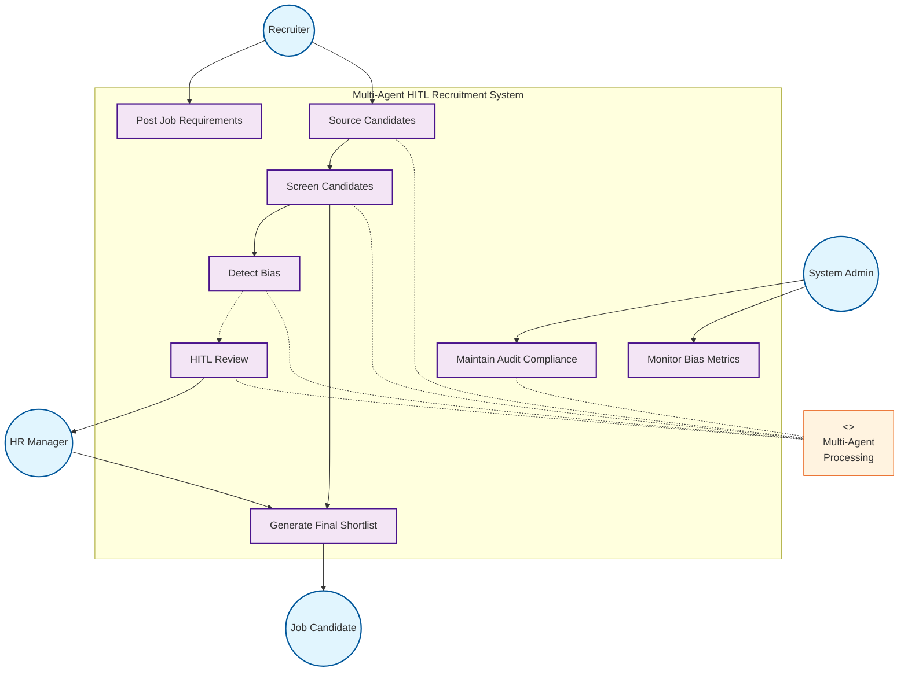
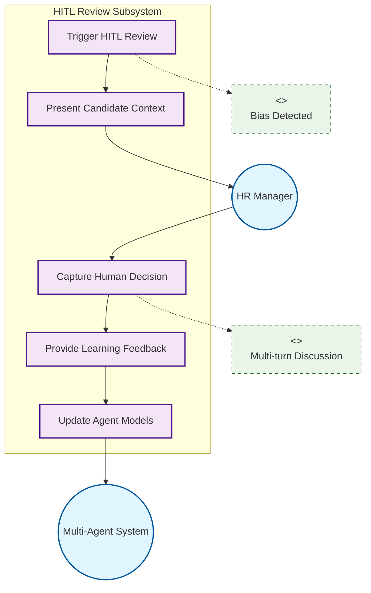
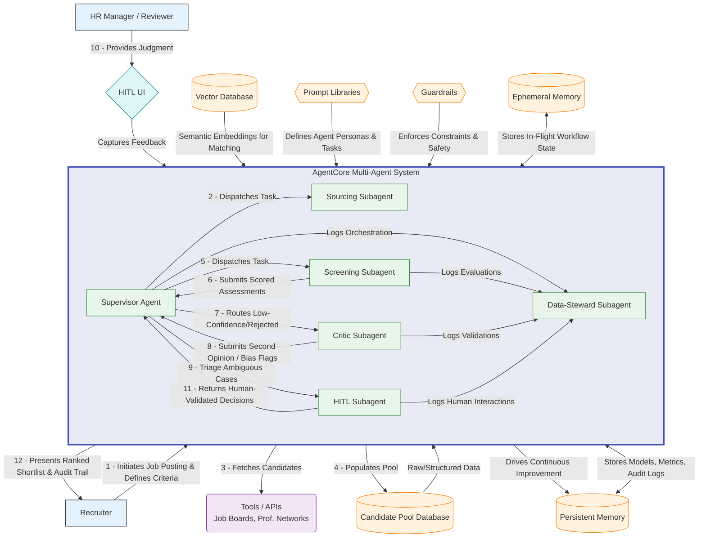
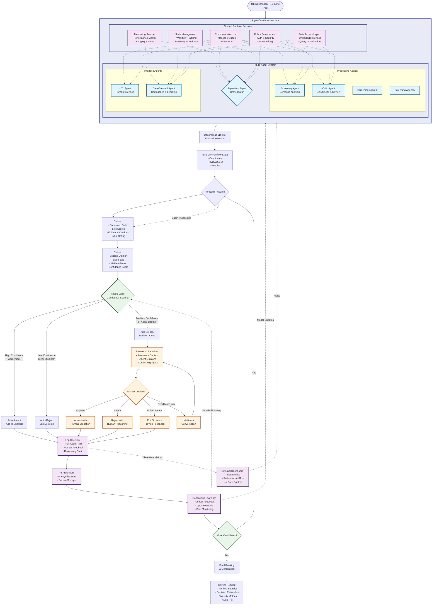

# Chapter 4: System Design

## 4.1 System Requirements

### 4.1.1 Executive Summary

**Goal**: Reduce false rejection rate (FRR) in talent acquisition from 12-35% to 6-18% through AI-powered semantic understanding.

**Key Performance Targets**

| Metric                | Current Baseline | Target        | Business Impact                         |
| --------------------- | ---------------- | ------------- | --------------------------------------- |
| False Rejection Rate  | 12-35%           | 6-18% (50% ↓) | 25% more qualified candidates reviewed  |
| Keyword Miss Rate     | 40-60%           | <15%          | 73% fewer synonym-based rejections      |
| Non-Traditional Bias  | 67% penalty      | <15% penalty  | 340% increase in career-changer success |
| Human Review Workload | 100%             | 15-25%        | 75-85% efficiency gain                  |
| Decision Consistency  | 0.31 kappa       | >0.85 kappa   | 3× more reliable outcomes               |

**Primary Goals**: (1) Reduce FRR by 50% via semantic understanding, (2) Cut bias to <15% via transferable skills, (3) Provide 100% decision transparency, (4) Optimize human review to 15-25%

### 4.1.2 Functional Requirements

| ID        | Module   | Requirement                                                    | Priority | Tag        |
| --------- | -------- | -------------------------------------------------------------- | -------- | ---------- |
| **FR-01** | Semantic | Parse PDF/DOCX/HTML/text resumes with 95%+ accuracy            | MUST     | [PARSE]    |
| **FR-02** | Semantic | Match skills with >0.85 cosine similarity (30K+ term ontology) | MUST     | [SEMANTIC] |
| **FR-03** | Semantic | Differentiate context (e.g., Java programming vs coffee)       | MUST     | [SEMANTIC] |
| **FR-04** | Semantic | Handle abbreviations intelligently (ML → Machine Learning)     | MUST     | [SEMANTIC] |
| **FR-05** | Bias     | Map transferable skills across industries                      | MUST     | [BIAS]     |
| **FR-06** | Bias     | Contextualize employment gaps without auto-rejection           | MUST     | [BIAS]     |
| **FR-07** | Bias     | Monitor selection rates with <5% demographic disparity         | MUST     | [BIAS]     |
| **FR-08** | Bias     | Generate counterfactual scenarios for borderline cases         | SHOULD   | [BIAS]     |
| **FR-09** | Explain  | Generate <120 word explanations for all decisions              | MUST     | [EXPLAIN]  |
| **FR-10** | Explain  | Cite specific resume sections as evidence                      | MUST     | [EXPLAIN]  |
| **FR-11** | Explain  | Capture recruiter feedback and overrides                       | MUST     | [EXPLAIN]  |
| **FR-12** | Explain  | Show comparative rankings between candidates                   | SHOULD   | [EXPLAIN]  |
| **FR-13** | HITL     | Route confidence <0.7 cases for human review                   | MUST     | [HITL]     |
| **FR-14** | HITL     | Present structured review interface (<2 min/review)            | MUST     | [HITL]     |
| **FR-15** | HITL     | Enable collaborative team discussions                          | SHOULD   | [HITL]     |

### 4.1.3 Non-Functional Requirements

| Category        | ID     | Requirement                | Target                  | Tag    |
| --------------- | ------ | -------------------------- | ----------------------- | ------ |
| **Performance** | NFR-01 | Resume processing latency  | <250ms avg, <500ms P95  | [PERF] |
|                 | NFR-02 | Batch throughput           | 1000+ resumes/hour      | [PERF] |
|                 | NFR-03 | System availability        | 99.5% uptime SLA        | [PERF] |
| **Fairness**    | NFR-04 | Demographic parity gap     | <5% selection rate diff | [FAIR] |
|                 | NFR-05 | Individual consistency     | ±5% score variance      | [FAIR] |
|                 | NFR-06 | Transparency documentation | Public model cards      | [FAIR] |
| **Security**    | NFR-07 | Data encryption            | TLS 1.3, AES-256        | [SEC]  |
|                 | NFR-08 | Access control             | RBAC with MFA           | [SEC]  |
|                 | NFR-09 | GDPR compliance            | Right to explanation    | [SEC]  |
| **Operations**  | NFR-10 | Architecture               | Microservices with APIs | [OPS]  |
|                 | NFR-11 | Observability              | Distributed tracing     | [OPS]  |
|                 | NFR-12 | Test coverage              | >80% unit tests         | [OPS]  |

### 4.1.4 Success Metrics & Verification

| Metric                       | Current | Target | Measurement              | Verification                |
| ---------------------------- | ------- | ------ | ------------------------ | --------------------------- |
| **M1. False Rejection Rate** | 12-35%  | 6-18%  | Expert panel validation  | A/B test vs traditional ATS |
| **M2. Recall@25**            | Unknown | >80%   | % qualified in top 25    | Retrospective hire analysis |
| **M3. Human Review Rate**    | 100%    | 15-25% | % requiring intervention | Workload analytics          |
| **M4. Keyword Miss Rate**    | 40-60%  | <15%   | Synonym test suite       | Domain expert evaluation    |
| **M5. Non-Traditional Bias** | 67%     | <15%   | Selection rate ratios    | Statistical parity test     |
| **M6. Decision Consistency** | 0.31    | >0.85  | Cohen's kappa            | Multi-reviewer study        |
| **M7. Explainability**       | N/A     | >90%   | User satisfaction (1-5)  | Quarterly surveys           |

### 4.1.5 Requirements Traceability Matrix

| Design Flaw (Ch. 3)           | Solution Component | Functional Req | Non-Functional Req | Success Metric | Verification Method     |
| ----------------------------- | ------------------ | -------------- | ------------------ | -------------- | ----------------------- |
| Static Keywords (40-60% miss) | Meaning Matcher    | FR-01 to FR-04 | NFR-01, NFR-02     | M1, M4         | Synonym test suite      |
| Homogeneity Bias (67% bias)   | Career Translator  | FR-05 to FR-08 | NFR-04, NFR-05     | M5             | Statistical parity test |
| Black-Box Scoring             | Decision Explainer | FR-09 to FR-12 | NFR-06, NFR-09     | M6, M7         | User surveys, audits    |
| Reviewer Fatigue              | HITL Integration   | FR-13 to FR-15 | NFR-03, NFR-14     | M3             | Workload analytics      |

### 4.1.6 Acceptance Criteria

System ready for production when:

- All MUST requirements implemented and tested
- NFR targets met on representative load
- Third-party bias audit shows <5% disparity
- > 80% satisfaction in 10+ company pilot
- GDPR/EEOC compliance certified

### 4.1.7 Change Management

Requirements baselined at v1.0. Changes require: RFC submission → stakeholder review → updated RTM → version increment.

## 4.2 Use-case Overview

### 4.2.1 System Actors

**External Human Users**

**Recruiter** – Hiring process owner  
Drives the end-to-end recruitment workflow and candidate evaluation.

- Create job postings and criteria
- Source and manage candidates
- Provide context for edge cases

**HR Manager** – Strategic oversight  
Ensures quality control and makes final hiring decisions.

- Review uncertain cases (HITL\*)
- Approve final hiring decisions
- Monitor compliance and bias

**Job Candidate** – System applicant  
Engages with the system throughout the application process.

- Submit applications and documents
- Receive status updates
- Provide additional information

**System Administrator** – Technical operations  
Maintains system health and security.

- Configure system settings
- Manage user permissions
- Generate compliance reports

**External Systems**

**Data Sources** – Information providers  
Supply candidate information from various platforms.

- Job boards and aggregators
- Professional networks (LinkedIn, etc.)
- Talent databases

**Internal System**

**Multi-Agent System** – Automated processing engine  
Coordinates specialized AI agents to automate hiring tasks:

- **Sourcing Agents**: Find candidates across platforms
- **Screening Agents**: Evaluate against requirements
- **Bias Detection Agents**: Monitor for fairness
- **Collaboration Agents**: Manage human-AI handoffs
- **Compliance Agents**: Track decisions and audits

\*HITL = Human-in-the-Loop for complex decision review

### 4.2.2 System Use Case Model

#### Core Use Case Categories

| ID        | Use Case              | Actor         | Description                                            | Category              |
| --------- | --------------------- | ------------- | ------------------------------------------------------ | --------------------- |
| **JM-01** | Post Job Requirements | 👤 Recruiter  | Creates job posting with skills and criteria           | Define & Publish Jobs |
| **JM-02** | Source Candidates     | 🤖 System     | Discovers candidates from multiple platforms           | Define & Publish Jobs |
| **JM-03** | Manage Candidate Pool | 🤖 System     | Deduplicates and filters eligible applicants           | Define & Publish Jobs |
| **JM-04** | Add Manual Candidates | 👤 Recruiter  | Includes specific candidates with notes                | Define & Publish Jobs |
| **CS-01** | Screen Resumes        | 🤖 System     | Matches candidate skills to job requirements           | Discover & Screen     |
| **CS-02** | Detect Bias           | 🤖 System     | Checks screening decisions for discrimination patterns | Discover & Screen     |
| **CS-03** | Score Candidates      | 🤖 System     | Generates rankings with evidence-based rationales      | Discover & Screen     |
| **CS-04** | Validate Results      | 🤖 System     | Cross-checks outcomes between multiple agents          | Discover & Screen     |
| **HR-01** | Trigger Human Review  | 🤖 System     | Escalates low-confidence or flagged cases              | Human Review          |
| **HR-02** | Present Context       | 🤖 System     | Displays agent analysis and conflicting assessments    | Human Review          |
| **HR-03** | Capture Decisions     | 👤 HR Manager | Records human approvals, rejections, and feedback      | Human Review          |
| **HR-04** | Enable Discussion     | 👤 HR Manager | Supports clarification for complex cases               | Human Review          |
| **DM-01** | Generate Shortlist    | 🤖 System     | Produces final rankings with transparent rationales    | Decide & Improve      |
| **DM-02** | Maintain Audit Trail  | 🤖 System     | Logs all decisions for compliance review               | Decide & Improve      |
| **DM-03** | Monitor Fairness      | 🤖 System     | Tracks diversity metrics and bias indicators           | Decide & Improve      |
| **DM-04** | Learn from Feedback   | 🤖 System     | Improves models based on human decisions               | Decide & Improve      |

**Category Descriptions:**

- **Define & Publish Jobs**: Set up job openings and requirements for automated processing
- **Discover & Screen**: Evaluate applicants against job requirements with bias detection
- **Human Review**: Handle uncertain cases requiring human judgment
- **Decide & Improve**: Finalize selections and learn from outcomes

#### Use Case Flow

```
Post Job → Source Candidates → Screen Resumes → Detect Bias
                                      ↓
                              (low confidence)
                                      ↓
                              Human Review → Capture Decision
                                      ↓
                              Generate Shortlist → Audit Trail
```

Key relationships:

- Job posting automatically triggers candidate sourcing
- All screening includes mandatory bias detection
- Low-confidence cases escalate to human review
- Complex reviews may require multiple discussion rounds



### 4.2.3 Key Operational Scenarios

#### Primary Use Case Scenarios

| UC-ID    | Name                             | Primary Actor        | Pre-conditions                                                                                   | Main Steps                                                                                                                                                                                                                                                                                                                  | Post-conditions                                                                                                |
| -------- | -------------------------------- | -------------------- | ------------------------------------------------------------------------------------------------ | --------------------------------------------------------------------------------------------------------------------------------------------------------------------------------------------------------------------------------------------------------------------------------------------------------------------------- | -------------------------------------------------------------------------------------------------------------- |
| UC-OP-01 | Standard Automated Screening     | Multi-Agent System   | • Job requirements posted<br>• Candidate pool sourced<br>• Evaluation rubric defined             | 1. Retrieve candidate profiles from source pool<br>2. Analyze resumes against job rubric<br>3. Validate decisions via bias detection<br>4. Generate confidence scores and rationales<br>5. Process high-confidence decisions automatically<br>6. Send automated status updates to candidates<br>7. Log complete audit trail | • Candidates scored and categorized<br>• Audit trail recorded<br>• 70-80% processed without human intervention |
| UC-OP-02 | HITL Intervention for Edge Cases | HR Manager           | • Low confidence score (<0.7)<br>• Bias flag raised<br>• Agent disagreement detected             | 1. Detect uncertainty in evaluation<br>2. Escalate case with structured context<br>3. Present agent analyses and conflicts<br>4. Facilitate interactive discussion<br>5. Capture human decision and rationale<br>6. Update system models with feedback<br>7. Communicate decision to candidate                              | • Human-validated decision recorded<br>• System learning updated<br>• Complex case resolved                    |
| UC-OP-03 | Bias Detection and Mitigation    | System Administrator | • Bias patterns detected<br>• Discrimination threshold exceeded<br>• Compliance review triggered | 1. Identify potential discrimination patterns<br>2. Send alerts to HR Manager and Admin<br>3. Analyze historical decisions<br>4. Implement mitigation strategies<br>5. Re-evaluate affected candidates<br>6. Generate compliance report<br>7. Initiate ongoing monitoring                                                   | • Bias mitigation applied<br>• Compliance documented<br>• Monitoring activated                                 |

#### Supporting Use Case Scenarios

| UC-ID    | Name                       | Primary Actor | Pre-conditions                                                                             | Main Steps                                                                                                                                                                                                                                                                      | Post-conditions                                                                           |
| -------- | -------------------------- | ------------- | ------------------------------------------------------------------------------------------ | ------------------------------------------------------------------------------------------------------------------------------------------------------------------------------------------------------------------------------------------------------------------------------- | ----------------------------------------------------------------------------------------- |
| UC-OP-04 | Manual Candidate Addition  | Recruiter     | • Active job posting<br>• Candidate information available<br>• Recruiter has system access | 1. Add candidate profile manually<br>2. Validate profile completeness<br>3. Request missing information if needed<br>4. Enrich profile with context notes<br>5. Attach portfolio/work samples<br>6. Tag with manual source indicator<br>7. Route to standard screening workflow | • Candidate integrated into pool<br>• Enhanced context preserved<br>• Screening initiated |
| UC-OP-05 | Multi-turn HITL Discussion | HR Manager    | • Complex case flagged<br>• Initial review incomplete<br>• Clarification needed            | 1. Review initial case presentation<br>2. Request specific clarifications<br>3. System provides additional context<br>4. Iterative Q&A exchange<br>5. Reach informed decision<br>6. Document discussion thread<br>7. Finalize candidate status                                  | • Complex case clarified<br>• Decision trail complete<br>• Learning data captured         |

#### HITL Review Process Flow



## 4.3 Multi-Agent Architecture

### 4.3.1 Subagent Specifications

The multi-agent recruitment system operates through a distributed plan where six specialized agents collaborate to transform job requirements and candidate pools into ranked shortlists. Each agent contributes a distinct capability—sourcing discovers candidates, screening evaluates fit, critic validates decisions, HITL handles ambiguity, supervisor orchestrates workflow, and data-steward ensures compliance—while maintaining shared context and advancing toward the common goal of identifying qualified candidates with minimal bias and maximal transparency.

#### a. Supervisor Agent (Orchestrator)

**Role**: Central coordinator implementing supervisor-router pattern for multi-agent recruitment workflows.

**Core Responsibilities**: The supervisor decomposes job descriptions into evaluation rubrics, orchestrates task distribution across agents, and synthesizes their outputs while maintaining human review rates at 15-25% through intelligent triage.

**Plan Contribution**: Establishes the shared evaluation framework and orchestrates agent collaboration to achieve recruitment goals.

**Inputs/Outputs**: Job descriptions, candidate pools, agent analyses, human feedback → evaluation rubrics, routing decisions, ranked shortlists.

**Memory**: Ephemeral—workflow states, candidate processing status, communication logs. Persistent—performance metrics, triage patterns, optimization data. Permissions—full read/write access to all agent outputs and system coordination data.

#### b. Sourcing Subagent

**Role**: Multi-channel candidate discovery specialist building comprehensive candidate pools from external sources.

**Core Responsibilities**: The sourcing agent discovers and aggregates candidates from multiple channels, deduplicates profiles, and tracks metadata while applying initial eligibility filters.

**Plan Contribution**: Provides the raw candidate pool that feeds into screening and evaluation workflows.

**Inputs/Outputs**: Job requirements, sourcing parameters, manual uploads → standardized candidate pools with metadata.

**Memory**: Ephemeral—search sessions, API rate limits. Persistent—sourcing patterns, channel effectiveness metrics. Permissions—read access to job requirements, write access to candidate pools.

#### c. Screening Subagent

**Role**: Semantic analysis specialist evaluating candidate-job fit.

**Core Responsibilities**: The screening agent transforms unstructured resumes into scored assessments, extracting skills and experience to generate evidence-based evaluations with cited rationales.

**Plan Contribution**: Transforms unstructured candidate data into scored assessments that feed into triage decisions.

**Inputs/Outputs**: Resumes, evaluation rubrics, job requirements → structured analyses with scores and rationales.

**Memory**: Ephemeral—analysis sessions, scoring calculations. Persistent—match patterns, skill recognition improvements. Permissions—read access to candidate data, write access to analysis results.

#### d. Critic Subagent

**Role**: Independent validator identifying overlooked candidates and bias patterns.

**Core Responsibilities**: The critic re-examines rejected candidates through alternative lenses to identify transferable skills—recognizing, for instance, that "community organizing" transfers to "project management" or "military logistics" maps to "supply chain management."

**Plan Contribution**: Acts as quality control, ensuring qualified candidates aren't incorrectly filtered out.

**Inputs/Outputs**: Screening results, original candidate data → second opinions, bias flags, hidden gems, confidence assessments.

**Memory**: Ephemeral—review cases, detection results. Persistent—bias patterns, correction histories, fairness metrics. Permissions—read access to screening outputs, write access to validation flags.

#### e. Human-in-the-Loop (HITL) Subagent

**Role**: Human-AI collaboration interface for ambiguous case resolution.

**Core Responsibilities**: The HITL agent presents ambiguous cases with highlighted conflicts, captures human verdicts and rationales, and enables multi-turn clarification when needed.

**Plan Contribution**: Ensures human judgment guides edge cases while capturing feedback to improve agent performance.

**Inputs/Outputs**: Ambiguous cases, conflicting opinions → human decisions, corrected evaluations, clarification responses.

**Memory**: Ephemeral—active sessions, pending decisions, conversation contexts. Persistent—decision patterns, interaction flows, reviewer analytics. Permissions—read access to uncertain cases, write access to human feedback.

#### f. Data-Steward Subagent

**Role**: Compliance and continuous improvement specialist.

**Core Responsibilities**: The data-steward maintains immutable audit trails while anonymizing PII, monitoring bias metrics, and transforming human feedback into privacy-preserving training datasets.

**Plan Contribution**: Ensures all decisions are traceable and compliant while driving continuous improvement through learning loops.

**Inputs/Outputs**: All system interactions and decisions → audit trails, anonymized datasets, bias reports, training data.

**Memory**: Ephemeral—current audit records, monitoring alerts. Persistent—historical archives, bias trends, improvement metrics. Permissions—universal read access, restricted write to audit logs and anonymized data.

### 4.3.2 System Architecture Diagram



#### 4.3.2.1 Architectural Patterns

The system employs several key architectural patterns:

**Orchestrator Pattern**: The Supervisor Agent acts as a central coordinator, receiving high-level requests from recruiters and decomposing them into specific tasks for downstream agents. This provides clear separation of concerns and enables independent scaling of components.

**Micro-Agent Architecture**: Each agent (Sourcing, Screening, Critic, HITL, Data-Steward) operates as an independent, task-specific service with well-defined interfaces. Agents communicate through messages, not shared memory, enabling versioning and hot-swapping without system-wide changes.

**Human-in-the-Loop Control**: The system implements conditional escalation where low-confidence or policy-violating outputs trigger human review. The HITL Agent manages this break-glass mechanism, ensuring human oversight for edge cases while maintaining automation efficiency.

**Post-Decisional Critique Pattern**: The Critic Agent reviews screening decisions after they're made, focusing on bias detection and hidden gem discovery. This separation of generation from evaluation ensures systematic quality control.

**Sidecar Compliance Pattern**: The Data-Steward Agent operates as an observer, capturing all system interactions for audit trails without interfering with core business logic. This enables compliance with regulations while maintaining system performance.

#### 4.3.2.2 Data Flow Semantics

The numbered flow (1-12) represents a complete recruitment cycle:

1. **Initiation**: Recruiter defines job posting and criteria → AgentCore System
2. **Task Distribution**: Supervisor dispatches sourcing task → Sourcing Subagent
3. **External Integration**: AgentCore fetches candidates → External APIs (job boards, LinkedIn)
4. **Data Population**: AgentCore populates → Candidate Pool Database
5. **Screening Dispatch**: Supervisor dispatches evaluation → Screening Subagent
6. **Assessment Generation**: Screening Subagent submits scored assessments → Supervisor
7. **Quality Review**: Supervisor routes low-confidence/rejected cases → Critic Subagent
8. **Bias Detection**: Critic submits second opinion/bias flags → Supervisor
9. **Human Escalation**: Supervisor triages ambiguous cases → HITL Subagent
10. **Human Decision**: HR Manager provides judgment via HITL UI
11. **Decision Capture**: HITL returns human-validated decisions → Supervisor
12. **Result Delivery**: AgentCore presents ranked shortlist & audit trail → Recruiter

Parallel to this main flow, all agents continuously log activities to the Data-Steward Subagent for compliance and learning purposes.

#### 4.3.2.3 Memory Architecture

The system implements a layered memory architecture:

**Ephemeral Memory**: Stores active workflow states, in-flight conversations, and session data. This memory is cleared after job completion, optimizing for performance and privacy.

**Persistent Memory**: Maintains long-term audit logs, bias trend analysis, model performance metrics, and compliance records. Bi-directional connection with Data-Steward enables continuous learning.

**Vector Database**: Houses semantic embeddings for advanced matching between job requirements and candidate profiles. Both Screening and Critic agents leverage this for similarity-based evaluation.

**Candidate Pool Database**: Structured storage for candidate profiles, standardized data, and metadata. Serves as the primary source of truth for candidate information.

**Prompt Libraries & Guardrails**: Static governance assets that define agent behaviors and enforce policy constraints. These act as cross-cutting concerns applied to all agent operations.

#### 4.3.2.4 Key Design Decisions

**Post-Decisional Review**: Bias detection occurs after initial screening, allowing for independent validation rather than constraining the primary evaluation process.

**Confidence-Based Routing**: The system uses dynamic confidence thresholds to determine which decisions require human review, optimizing the balance between automation and oversight.

**Centralized Orchestration**: The Supervisor Agent maintains workflow state and coordination logic, while execution remains distributed across specialized agents.

**Event-Driven Architecture**: Asynchronous message passing enables scalability and resilience, with each agent processing tasks independently.

**Polyglot Persistence**: Different data stores serve different needs - relational for structured data, vector for embeddings, key-value for state, and immutable logs for audit trails.

#### 4.3.2.5 AgentCore Infrastructure

The diagram includes a special node labeled "AgentCore" that differs fundamentally from the other agent nodes. This represents the **shared runtime infrastructure** rather than a specific agent:

**Not an Agent, but a Platform**: Unlike the named agents (Supervisor, Sourcing, Screening, etc.), AgentCore is the underlying framework that enables all agents to function. It provides common services and abstractions that agents build upon.

**Infrastructure Services**:

- **Policy Enforcement**: Receives configuration from Prompt Libraries and Guardrails, applying these consistently across all agent operations
- **Data Access Layer**: Manages connections to the Candidate Pool Database, Vector Database, and Ephemeral Memory on behalf of all agents
- **State Management**: Handles session state and workflow context that agents can access but don't manage directly
- **Runtime Isolation**: Ensures agents remain independent while sharing common infrastructure

**Architectural Significance**: The invisible styling (white fill, white stroke) in the diagram emphasizes that AgentCore operates "behind the scenes" as infrastructure rather than as a participant in the business workflow. This separation of concerns allows agents to focus on their specific tasks while the framework handles cross-cutting concerns like data access, policy enforcement, and state management.

This design pattern is similar to container orchestration platforms where the runtime (like Kubernetes) provides services to applications without being an application itself.

### 4.3.3 Communication Patterns

The multi-agent system employs message-based communication with several key characteristics:

**Agent Isolation**: No shared state between agents ensures fault isolation and enables independent deployment cycles.

**Cross-Cutting Logging**: Every agent interaction is observed by the Data-Steward, creating comprehensive audit trails without modifying core agent logic.

**Feedback Integration**: The HITL UI captures not just decisions but also reasoning and corrections, feeding back into system improvement.

**Asynchronous Messaging**: Non-blocking communication patterns prevent cascading failures and enable elastic scaling based on workload.

### 4.3.4 Workflow State Management



#### Phase 1: Initialization (Supervisor Agent)

- Decomposes job description into structured evaluation criteria
- Extracts required skills, experience levels, qualifications
- Sets up workflow state management for tracking progress

#### Phase 2: Parallel Screening (Multi-Agent Processing)

- Multiple screening agents process resumes concurrently
- Semantic analysis extracts structured data and initial scoring
- Load balancing across agent instances for scalability

#### Phase 3: Critical Review (Bias Mitigation)

- Critic agent provides independent second opinion
- Identifies potential biases in screening decisions
- Flags "hidden gems" that may have been undervalued

#### Phase 4: Intelligent Triage (Workload Control)

- Confidence scoring determines routing path
- Dynamic thresholds maintain review rate at small fraction (target: 15-25% to human review)
- Auto-decisions for clear cases, human review for ambiguous ones

#### Phase 5: Human-in-the-Loop (Quality Assurance)

- Structured interface presents conflicting opinions
- Multiple interaction patterns: approve/reject/edit/clarify
- Captures not just decisions but reasoning for learning

#### Phase 6: Continuous Learning (System Evolution)

- Data-Steward maintains complete audit trail
- Privacy protection through PII anonymization
- Feedback loops improve agent performance over time

### 4.3.5 Human-in-the-Loop (HITL) Interaction

#### Triage Criteria for Human Review:

- `|Screening_Score - Critic_Score|` > `disagreement_threshold`
- Confidence_Score < uncertainty_threshold
- Borderline candidates near acceptance boundary

#### HITL Patterns:

- Approve/Reject: Standard review workflow
- Edit/Annotate: Corrective feedback for learning
- Multi-turn: Complex case discussions
