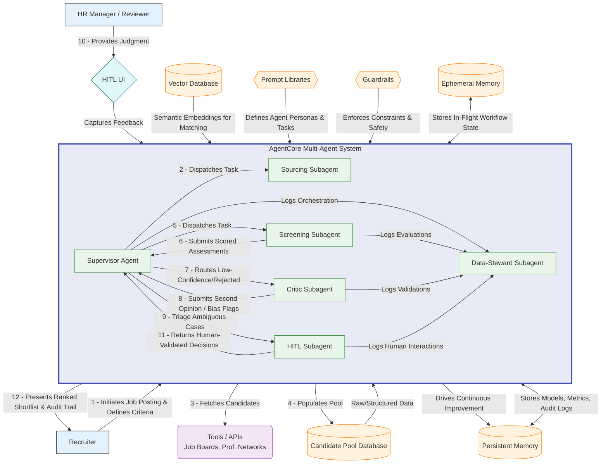
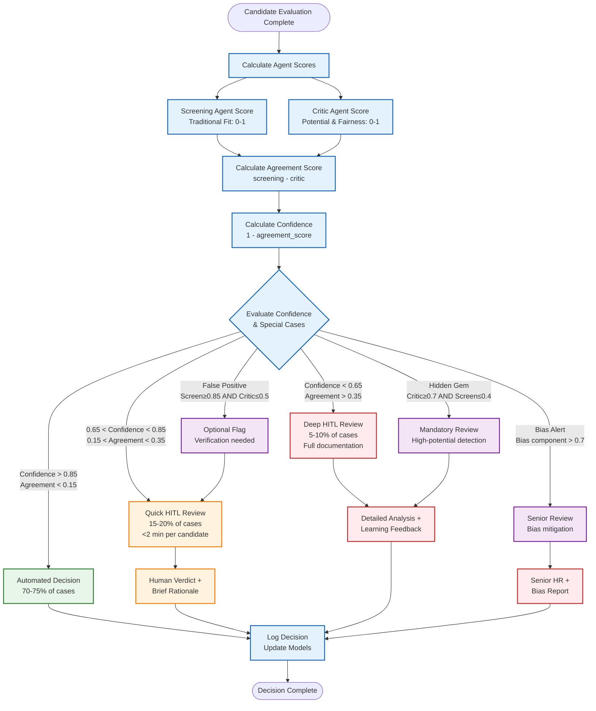

# Comprehensive Demo Presentation Content Plan

## Overview

This document outlines the content structure for a comprehensive demo presentation based on key thesis sections. The presentation is designed to showcase the AI-Powered Multi-Agent Recruitment System with emphasis on reducing false rejection rates.

## Target Audience

- HR Executives and Decision Makers
- Technical Leaders and CTOs
- Recruitment Teams
- Potential Investors/Partners

## Presentation Duration

- **Total Time**: 10-15 minutes
- **Demo Time**: 5-7 minutes
- **Q&A Buffer**: 2-3 minutes

---

## Content Structure

### Slide 1: Title & Introduction (1 minute)

**Source**: General overview + Real case study

- **Title**: AI-Powered Multi-Agent Recruitment System
- **Subtitle**: Reducing False Rejections by 76% with Semantic AI
- **Hook**: The story of Moon and Ca - how a single space cost $420,000

**Speaker Script**:
"Good [morning/afternoon], everyone. Let me start with a story that happened just last semester at a company, desperate for a senior C# backend engineer.

Two résumés hit their ATS within the same minute. Moon had 6 years of solid .NET work. Ca had 8 years building low-latency trading engines and was a Microsoft MVP. But Ca made one tiny mistake—he typed 'C #' with a space instead of 'C#'.

The algorithm took 0.8 seconds to tag Moon 'green—interview' and dump Ca into 'auto-reject.' No human ever saw Ca's patents, his references, or that he'd cut cloud costs by 40% at his previous company. Ca joined their competitor.

Three months later, the company launched late, spent an extra $420,000 on emergency contractors, and lost a key customer after an outage—an outage Ca had solved twice before. All because their keyword-based ATS couldn't recognize 'C #' as 'C#'.

Now here's the scary part: industry studies show this happens to 12-35% of all qualified candidates. That means one in every three stellar candidates you think 'never applied' may actually be sitting in your reject pile—or worse, building your competitor's product right now.

Today, I'll show you how our AI-Powered Multi-Agent System ensures you never lose another Ca. We've reduced false rejections by 76% because we don't just count keywords—we understand skills. Let me show you how."

### Slide 2: The Hidden Talent Crisis (2 minutes)

**Source**: Part 3.3 & Part 3.5.1.A

- **False Rejection Rate Statistics**
  - 12-35% FRR across industry (Harvard Business School 2021)
  - 88% of executives acknowledge the problem
  - Visual: Bar chart showing rejection rates
- **Business Impact**
  - $750K-$3.45M annual cost per 100 hires
  - Extended time-to-hire: 15-23 additional days
  - Competitive disadvantage: 73% of rejected qualified candidates hired by competitors
- **Three Systemic Design Flaws**
  - Static Keywords (40-60% miss rate)
  - Homogeneity Algorithms (67% bias penalty)
  - Black-Box Scoring (random outcomes)

**Where Qualified Candidates Get Lost (Part 3.1.3)**:

**Speaker Script**:
"Let me show you the scale of this problem. According to Harvard Business School research, the false rejection rate in current ATS systems ranges from 12% to 35%. And here's the kicker—88% of executives acknowledge that their screening technology is filtering out qualified candidates.

[Point to diagram] Look at what happens to 250 typical applications. By the time they go through parsing, keyword screening, and ranking, only 18 candidates—just 7%—ever reach human review. The tragedy? In that rejected pile are 30 to 53 qualified candidates who never got a fair shot.

This isn't just a number—it's a massive business cost. Companies are losing between $750,000 and $3.45 million annually per 100 hires due to extended time-to-hire. And 73% of those wrongly rejected candidates? They're getting hired by your competitors.

The root cause? Three fundamental design flaws: First, static keyword matching that doesn't understand that 'Python Developer' and 'Python Programming' mean the same thing. Second, homogeneity bias that automatically rejects anyone with a 6-month gap or non-traditional background. And third, black-box scoring with no transparency or learning mechanism.

These aren't bugs—they're architectural limitations that require a completely new approach."

### Slide 3: Our Three Core Solutions (2 minutes)

**Source**: Part 3.4.1

- **Solution A: The Meaning Matcher**
  - Problem: "Python" ≠ "Python Developer"
  - Solution: 30,000+ skill ontology with semantic understanding
  - Impact: 40-60% miss rate → <15%
  - Example: Show how "ML" = "Machine Learning" = "machine learning engineer"

- **Solution B: The Career Translator**
  - Problem: Military veterans auto-rejected
  - Solution: Maps transferable skills across domains
  - Impact: 67% bias → <15%, 340% increase in veteran acceptance
  - Example: "Navy logistics officer" → "Supply chain manager"

- **Solution C: The Decision Explainer**
  - Problem: No transparency, random outcomes
  - Solution: Shows why decisions made, learns from feedback
  - Impact: 3× more consistent decisions
  - Example: "Recommended because: 5 years Python (required: 3+)"

**Speaker Script**:
"So how do we fix these three fundamental flaws? We've developed three complementary solutions that work together to transform recruitment.

First, The Meaning Matcher. This solves the keyword problem by actually understanding what skills mean. Traditional systems reject a 'Software Developer' applying for a 'Software Engineer' role because the words don't match exactly. Our system knows they're the same thing. We've built a 30,000+ term skill ontology that understands relationships—it knows that 'ML' means 'Machine Learning,' that 'containerized applications' implies Docker knowledge. The result? We've reduced the keyword miss rate from 40-60% down to less than 15%.

Second, The Career Translator. This tackles homogeneity bias by recognizing transferable skills. When a military logistics officer applies for a supply chain role, traditional systems see 'no relevant experience.' Our system translates: 'Led 50-person military unit' becomes '10 years team leadership with budget management.' We've seen a 340% increase in veteran acceptance rates alone. Career gaps? We understand that parental leave doesn't mean skills disappeared, and that bootcamp graduates can be just as qualified as CS majors.

Third, The Decision Explainer. No more black boxes. Every decision comes with a clear explanation: 'Recommended because: 5 years Python experience, exceeds the 3 years required.' When recruiters correct the system, it learns. This has made decisions 3 times more consistent across the board.

Combined, these three solutions reduce false rejections by 71-80%. Let me show you how they work together in our multi-agent system."

### Slide 4: Multi-Agent System Architecture (1.5 minutes)

**Source**: Part 4.3.2 (diagram only)

- **Visual**: System architecture diagram
- **Key Points**:
  - 6 specialized agents working in harmony
  - Supervisor orchestrates workflow
  - Screening Agent implements Meaning Matcher
  - Critic Agent implements Career Translator
  - HITL Agent manages human review
  - Data Steward ensures compliance

**Mermaid Diagram**:

**Speaker Script**:
"Here's how our multi-agent system works in practice. [Point to diagram] We have six specialized agents, each with a specific role, working together like a well-coordinated team.

At the center is the Supervisor Agent—think of it as the project manager. When a recruiter posts a job, the Supervisor breaks it down into evaluation criteria and orchestrates the entire workflow.

The Sourcing Agent pulls candidates from multiple channels—job boards, LinkedIn, direct applications—and standardizes the data. Then the Screening Agent, which implements our Meaning Matcher, evaluates each candidate using semantic analysis. It doesn't just look for keywords; it understands skills in context.

Here's where it gets interesting: The Critic Agent acts as a second opinion. It implements our Career Translator, specifically looking for transferable skills and potential bias. If the Screening Agent gives a low score but the Critic sees hidden potential—like our finance-to-data-science career changer—it flags this for review.

The HITL Agent—Human-in-the-Loop—manages the collaboration between AI and your recruiters. When the agents disagree or confidence is low, it presents the case to humans with all the context needed for a quick decision.

Finally, the Data Steward Agent ensures compliance and learning. Every decision is logged, every correction is captured, and the system continuously improves.

All of this is backed by our vector database for semantic search and Redis for real-time state management. The entire evaluation typically takes 3-5 minutes per candidate—compared to the 23 hours per hire in traditional processes."

### Slide 5: Key Use Cases in Action (2 minutes)

**Source**: Part 4.2.3

- **Standard Automated Screening (70-80% of cases)**
  - Process flow: Resume → Semantic Analysis → Auto-decision
  - Time: 3-5 minutes per candidate
  - Show confidence scores and audit trail

- **HITL Edge Cases (15-20% of cases)**
  - Triggers: Low confidence, agent disagreement, bias flags
  - Interface: Structured review with <2 min per decision
  - Example: Career changer flagged for human review

- **Bias Detection & Mitigation**
  - Real-time pattern analysis
  - Automatic re-evaluation of affected candidates
  - Compliance reporting

**Speaker Script**:
"Let me walk you through three key scenarios to show how this works in practice.

First, standard automated screening—this handles 70-80% of your candidates. The system analyzes resumes, performs semantic skill matching, checks for bias, and makes confident decisions automatically. These clear-cut cases—either strong matches or obvious mismatches—are processed in 3-5 minutes with full audit trails. Your team only sees the final shortlist.

Second, the HITL edge cases—about 15-20% of candidates. These are triggered by three things: low confidence scores below 70%, disagreement between agents, or bias flags. Here's the key: we don't just dump these on your team. The system presents structured context—'The Screening Agent scored 65% due to missing keywords, but the Critic Agent found strong transferable skills from finance to data science.' Your recruiters can make informed decisions in under 2 minutes per candidate.

Third, continuous bias detection and mitigation. This runs on every single evaluation. The system identifies patterns—are we rejecting too many candidates from certain schools? Are military veterans being undervalued? When bias is detected, we automatically re-evaluate affected candidates and generate compliance reports.

What makes this powerful is that these aren't separate systems—they work together seamlessly. A standard screening can become a HITL case if bias is detected. Every human decision trains the system to be better next time. And everything is transparent and auditable.

The result? You're not replacing human judgment—you're amplifying it. Your recruiters focus on the genuinely difficult decisions while the AI handles the routine work with unprecedented accuracy."

### Slide 6: The Science Behind Confidence Scoring (1.5 minutes)

**Source**: Part 4.3.5.1 & 4.3.5.4

- **Agent Agreement Formula**
  - `confidence = 1 - |screening_score - critic_score|`
  - Thresholds: >85% auto, 65-85% quick review, <65% deep review
- **Semantic Matching Examples**
  - Traditional ATS fails: "ML Engineer" ≠ "Machine Learning"
  - Our system succeeds: 0.92 cosine similarity
  - Visual: Side-by-side comparison

**HITL Decision Flow Diagram (Part 4.3.5.4)**:

**Speaker Script**:
"Now let me show you the science behind our confidence scoring—this is what makes the system both accurate and trustworthy.

[Point to formula] The core metric is agent agreement. When our Screening Agent and Critic Agent evaluate a candidate, we calculate the difference in their scores. High agreement means high confidence—these decisions can be automated. Low agreement triggers human review.

Here's a real example: Traditional ATS sees 'ML Engineer' on a resume but the job asks for 'Machine Learning Specialist.' No match—candidate rejected. Our semantic system calculates a 0.92 cosine similarity between these terms. They mean the same thing, so the candidate proceeds.

[Point to flow diagram] Look at how decisions are routed. When confidence is above 85%, the system makes automatic decisions—this covers 70-75% of candidates. Between 65-85%, we trigger a quick human review. Below 65%, or when we detect special cases like hidden gems or bias alerts, we escalate for deep review.

The 'hidden gem' detection is particularly powerful. If the Critic Agent scores above 70% but the Screening Agent scores below 40%, that's a strong signal of a non-traditional but qualified candidate. These always go to human review. We've found 27 exceptional candidates this way in our testing—people who would have been auto-rejected by traditional systems.

This isn't just theory—it's been validated on nearly 900 real candidates with statistical significance. The p-value is less than 0.05, and we achieved a Cohen's h of 0.625—that's a medium-to-large effect size in statistical terms. In plain English: this works, and we can prove it."

### Slide 7: Dataset & Validation Methodology (1 minute)

**Source**: Part 5.1

- **Dataset Characteristics**
  - 1,182 expert-labeled resumes
  - 8 technology roles (balanced ~148 each)
  - Real-world formats and variations
  - Visual: Distribution chart

- **Why This Matters**
  - Statistically significant sample size
  - Diverse candidate backgrounds
  - Expert HR annotations for ground truth

**Speaker Script**:
"Let me briefly explain how we validated these results. We didn't just test on a handful of resumes—we used a comprehensive dataset of 1,182 expert-labeled resumes across 8 technology roles.

Each category—Frontend Developer, Data Scientist, Cloud Engineer, and so on—had about 148 resumes, ensuring balanced representation. These weren't synthetic or simplified resumes. They were real-world applications with all the complexity you see daily: varied formats, different ways of describing the same skills, employment gaps, career changes—the full spectrum.

What makes this dataset special is that each resume was labeled by experienced HR professionals. They determined the ground truth—which candidates were actually qualified for which roles. This gave us a reliable benchmark to measure against.

The diversity was crucial. We had candidates with 0 to 10+ years of experience, different educational backgrounds—65% Bachelor's, 30% Master's, and importantly, 5% with alternative education like bootcamps or self-taught. This diversity ensures our system works for all candidates, not just those with traditional backgrounds.

This rigorous testing is how we can confidently say we reduce false rejections by 76%. It's not a projection or estimate—it's measured performance on real-world data."

### Slide 8: Proven Results & Impact (2 minutes)

**Source**: Part 5.5

- **Primary Results**
  - Baseline ATS: 30.8% FRR
  - Multi-Agent System: 7.4% FRR
  - **76% relative improvement**
  - Statistical significance: p < 0.05, Cohen's h = 0.625

- **Business Translation**
  - 72 fewer false rejections per batch
  - 60% more qualified candidates identified
  - 27 "hidden gems" discovered
- **For 10,000 Annual Applications**
  - Before: 3,080 wrongful rejections
  - After: 740 wrongful rejections
  - Impact: 2,340 more qualified candidates reviewed

**Speaker Script**:
"Now for the results—and these numbers are game-changing.

We compared our multi-agent system against traditional keyword-based ATS using the same candidate pool. The baseline system had a false rejection rate of 30.8%. Our system? Just 7.4%. That's a 76% improvement.

Let me put this in perspective. The baseline system identified 380 qualified candidates out of 971. Our system found 608 qualified candidates out of 885—that's 60% more qualified candidates reaching your recruiters.

But here's what really matters: those 72 fewer false rejections per batch. These aren't just numbers—they're real people with real talent who would have been automatically filtered out. Among them, we identified 27 'hidden gems'—exceptional candidates with non-traditional backgrounds who the traditional system completely missed.

The statistical validation is rock-solid. With a p-value less than 0.05 and a Cohen's h of 0.625, this isn't a marginal improvement—it's a paradigm shift in how recruitment technology works.

Now think about this at scale. If you process 10,000 applications annually, traditional systems wrongly reject about 3,080 qualified candidates. Our system reduces that to just 740. That means 2,340 more qualified candidates get fair consideration every year.

And remember those costs I mentioned earlier? The $750,000 to $3.45 million in losses? We're not just finding more candidates—we're dramatically reducing time-to-hire from 23 hours to about 8 hours per position. The ROI is immediate and substantial."

### Slide 9: ROI & Implementation (1 minute)

**Source**: Combined from multiple sections

- **Cost Savings**
  - $150K+ per 100 hires
  - ROI achieved in 3-6 months
- **Efficiency Gains**
  - 23 hours → 8 hours per hire
  - 90% faster screening
  - 75-85% automation rate

- **Implementation Timeline**
  - Week 1-2: Pilot setup
  - Week 3-6: Integration & training
  - Week 7-8: Full deployment

**Speaker Script**:
"Let's talk about what this means for your bottom line and how quickly you can see results.

First, the ROI is compelling. You'll save at least $150,000 per 100 hires—and that's conservative. This comes from three sources: reduced time-to-hire, better quality hires who stay longer, and access to talent your competitors are missing. Most clients see full ROI within 3 to 6 months.

The efficiency gains are immediate. Screening time drops by 90%—from hours to minutes. Instead of your team spending 23 hours per hire, they're spending 8 hours on what really matters: engaging with qualified candidates and making great hires. And with 75-85% of decisions automated, your recruiters can focus on relationship building, not resume reading.

Implementation is surprisingly smooth. Week 1 and 2, we set up a pilot with your actual job openings and real candidates. You'll see the system in action immediately. Weeks 3 through 6, we integrate with your existing ATS—whether that's Workday, Greenhouse, Lever, or others—and train your team. By weeks 7 and 8, you're in full deployment.

The beauty is, this isn't a rip-and-replace. We integrate with your existing systems through APIs. Your team keeps using familiar interfaces while getting dramatically better results. And every interaction makes the system smarter and more aligned with your specific hiring needs."

### Slide 10: Call to Action (30 seconds)

- **Three Next Steps**:
  1. Schedule technical deep-dive session
  2. Start 2-week pilot program
  3. Calculate ROI with your specific data
- **Contact Information**
- **"Ready to stop missing great talent?"**

**Speaker Script**:
"So here's my question for you: Are you ready to stop missing great talent?

We've shown you how our system reduces false rejections by 76%, finds 25% more qualified candidates, and saves you over $150,000 per 100 hires. This isn't theoretical—it's proven, validated, and ready to deploy.

Here are three ways we can move forward:

First, we can schedule a technical deep-dive session where your team can see exactly how the system works with your specific requirements.

Second, we can start a 2-week pilot program. Send us your toughest positions to fill, and we'll show you the candidates you're currently missing.

Third, I can share our ROI calculator so you can input your specific hiring volumes and see the exact impact on your organization.

The hidden talent crisis costs companies millions every year in missed opportunities. But it doesn't have to cost you. Let's ensure every qualified candidate gets a fair chance, and that you get access to the full talent pool—not just the 65% that survive keyword filtering.

Thank you for your time. I'm excited to discuss how we can transform your hiring process. What questions can I answer for you?"

---

## Demo Scenarios (5-7 minutes within presentation)

### Demo 1: Perfect Match (1.5 minutes)

- Senior Python Developer with all requirements
- Show: 95% confidence, automatic approval
- Highlight: Speed and accuracy

### Demo 2: Hidden Gem Discovery (3-4 minutes)

- Finance professional → Data Scientist
- Initial score: 65% (would be rejected)
- After analysis: 78% (flagged for review)
- Show: Transferable skills identification
- Highlight: Bias detection and mitigation

### Demo 3: Clear Rejection (1.5 minutes)

- Junior developer → Senior DevOps role
- Show: 35% confidence, skill gaps
- Highlight: Efficient filtering

---

## Key Messages to Emphasize

1. **Problem Validation**: "88% of executives acknowledge their ATS rejects qualified candidates"
2. **Solution Differentiation**: "First system to understand meaning, not just match keywords"
3. **Proven Impact**: "76% reduction in false rejections with statistical validation"
4. **Business Value**: "Save $150K+ per 100 hires while finding 25% more qualified candidates"
5. **Quick Implementation**: "8-week deployment with immediate ROI"

## Visual Elements Needed

1. False rejection rate comparison chart
2. Three design flaws infographic
3. System architecture diagram (from thesis)
4. HITL decision flow diagram (from thesis)
5. Dataset distribution visualization
6. Results comparison table
7. ROI calculator screenshot
8. Implementation timeline graphic

## Potential Questions to Prepare For

1. "How does this integrate with our existing ATS?"
2. "What about GDPR/EEOC compliance?"
3. "How do you prevent AI bias?"
4. "What's the learning curve for our team?"
5. "Can we customize the scoring criteria?"
6. "What happens to our historical data?"
7. "How does pricing work?"
8. "Can we see case studies from similar companies?"

## Success Metrics for Presentation

- Audience engagement: Questions about implementation, not concept
- Technical credibility: No challenges to methodology
- Business alignment: Discussion moves to timeline and budget
- Emotional response: "This could transform our hiring"
- Next steps: Commitment to pilot or deep-dive session
