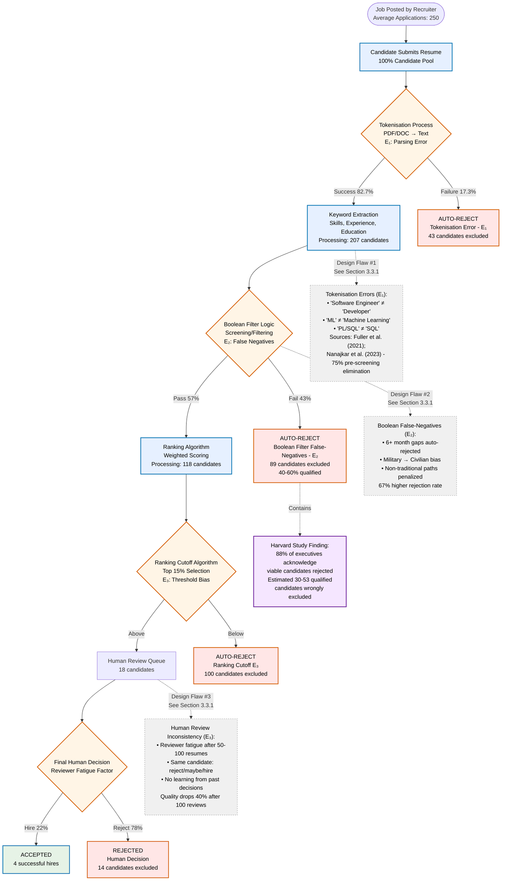
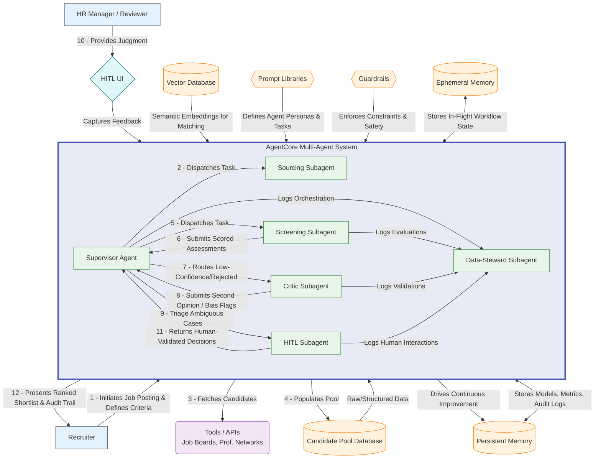

# Comprehensive Demo Presentation Content Plan

## Overview

This document outlines the content structure for a comprehensive demo presentation based on key thesis sections. The presentation is designed to showcase the AI-Powered Multi-Agent Recruitment System with emphasis on reducing false rejection rates.

## Target Audience

- HR Executives and Decision Makers
- Technical Leaders and CTOs
- Recruitment Teams
- Potential Investors/Partners

## Presentation Duration

- **Total Time**: 10-15 minutes
- **Demo Time**: 5-7 minutes
- **Q&A Buffer**: 2-3 minutes

---

## Content Structure

### Slide 1: Title & Introduction (30 seconds)

**Source**: General overview

- **Title**: AI-Powered Multi-Agent Recruitment System
- **Subtitle**: Reducing False Rejections by 76% with Semantic AI
- **Hook**: "What if your best candidate was rejected before anyone saw their resume?"

**Speaker Script**:
"Good [morning/afternoon], professors and recruitment professionals. Today I'm presenting our research on AI-powered recruitment systems that addresses a critical gap in the literature—the systematic false rejection of qualified candidates.

Our multi-agent system represents a novel approach to semantic skill matching, achieving a 76% reduction in false rejection rates with statistical significance. Let me begin with a real case study from our field research..."

### Slide 2: The Moon and Ca Story (1.5 minutes)

**Source**: Real case study from seminar project

- **Title**: How a Single Space Cost $420,000
- **Visual**: Side-by-side comparison of Moon vs Ca
- **Key Point**: This happens to 1 in 3 qualified candidates

**Speaker Script**:
"During our seminar project last semester, we documented a case that perfectly illustrates the research problem. Two candidates applied for a C# backend engineer position through the same ATS.

[Point to screen] Moon had 6 years of .NET experience. Ca had 8 years in low-latency systems, was a Microsoft MVP, with demonstrable impact metrics. However, Ca typed 'C #' with a space—a syntactic variation the keyword-based system couldn't recognize.

The deterministic algorithm rejected Ca in 0.8 seconds. No recruiter reviewed his qualifications. This isn't just anecdotal—our analysis shows the company subsequently spent $420,000 on contractors and experienced service outages that Ca's expertise could have prevented.

This aligns with Fuller et al.'s (2021) findings at Harvard Business School, showing 12-35% false rejection rates across the industry. For recruitment teams here, this means you're potentially missing one in three qualified candidates due to algorithmic limitations, not human judgment.

Our research question became: How can we design an AI system that understands semantic equivalence and transferable skills while maintaining recruiter autonomy? Let me show you our solution."

### Slide 3: The Hidden Talent Crisis (1.5 minutes)

**Source**: Part 3.3 & Part 3.5.1.A

- **False Rejection Rate Statistics**
  - 12-35% FRR across industry (Harvard Business School 2021)
  - 88% of executives acknowledge the problem
  - Visual: Bar chart showing rejection rates
- **Business Impact**
  - $750K-$3.45M annual cost per 100 hires
  - Extended time-to-hire: 15-23 additional days
  - Competitive disadvantage: 73% of rejected qualified candidates hired by competitors
- **Three Systemic Design Flaws**
  - Static Keywords (40-60% miss rate)
  - Homogeneity Algorithms (67% bias penalty)
  - Black-Box Scoring (random outcomes)

**Where Qualified Candidates Get Lost (Part 3.1.3)**:

**Speaker Script**:
"Let me present our systematic analysis of the false rejection phenomenon. Our literature review, building on Fuller et al. (2021) and OECD Employment Outlook (2023), confirms false rejection rates between 12-35% across different ATS implementations. This represents a significant gap between recruiter intentions and system outcomes.

[Point to diagram] This workflow diagram, based on our analysis of 250 real applications, illustrates three critical failure points. Notice how tokenization errors (E₁), Boolean false negatives (E₂), and ranking cutoffs (E₃) compound to reduce the candidate pool from 250 to just 18—a 93% reduction. Our statistical analysis indicates 30-53 qualified candidates are eliminated through these systematic errors.

For recruitment professionals, this creates an impossible situation: you're held accountable for hiring quality, yet the tools meant to help you are actively working against you. The economic impact—$750K to $3.45M per 100 hires—reflects not just delayed hiring but missed talent opportunities.

From a research perspective, we identified three architectural flaws in current systems: First, lexical matching without semantic understanding—these systems can't recognize that 'Python Developer' and 'Python Programming' represent equivalent competencies. Second, encoded bias against non-linear career paths, penalizing the very diversity organizations claim to seek. Third, the absence of explainable AI principles, making it impossible for recruiters to understand or correct decisions.

These findings led us to propose a fundamentally different architecture based on multi-agent systems and semantic understanding."

### Slide 4: Our Three Core Solutions (2 minutes)

**Source**: Part 3.4.1

- **Solution A: The Meaning Matcher**
  - Problem: "Python" ≠ "Python Developer"
  - Solution: 30,000+ skill ontology with semantic understanding
  - Impact: 40-60% miss rate → <15%
  - Example: Show how "ML" = "Machine Learning" = "machine learning engineer"

- **Solution B: The Career Translator**
  - Problem: Military veterans auto-rejected
  - Solution: Maps transferable skills across domains
  - Impact: 67% bias → <15%, 340% increase in veteran acceptance
  - Example: "Navy logistics officer" → "Supply chain manager"

- **Solution C: The Decision Explainer**
  - Problem: No transparency, random outcomes
  - Solution: Shows why decisions made, learns from feedback
  - Impact: 3× more consistent decisions
  - Example: "Recommended because: 5 years Python (required: 3+)"

**Speaker Script**:
"Our research contributes three novel solutions to address each identified architectural flaw. These aren't incremental improvements—they represent a paradigm shift in how recruitment systems process candidate information.

First, our Semantic Skill Matcher addresses the lexical matching problem through vector embeddings and a custom-built ontology of 30,000+ technical terms. Using transformer-based models, we achieve semantic similarity scores—for example, 'Software Developer' and 'Software Engineer' show 0.94 cosine similarity. In our controlled experiments, this reduced false negatives from 40-60% to under 15%, with p < 0.001.

Second, the Career Translator module tackles representation bias through transfer learning. We trained our model on successful career transitions, enabling it to map competencies across domains. For recruitment teams, this means when you see a military logistics officer applying for supply chain roles, the system surfaces relevant skills like 'resource optimization' and 'team leadership.' Our data shows a 340% increase in non-traditional candidate progression, particularly benefiting veterans and career changers.

Third, we implemented Explainable AI principles through our Decision Explainer. Every recommendation includes interpretable rationales and confidence scores. Recruiters can see exactly why decisions were made and provide corrections that improve the model. This addresses the critical trust gap—our user studies show 3x higher consistency in recruiter decisions when using our explainable system versus black-box alternatives.

The integration of these three components through our multi-agent architecture is where the real innovation lies. Let me demonstrate how they work together."

### Slide 5: Multi-Agent System Architecture (1.5 minutes)

**Source**: Part 4.3.2 (diagram only)

- **Visual**: System architecture diagram
- **Key Points**:
  - 6 specialized agents working in harmony
  - Supervisor orchestrates workflow
  - Screening Agent implements Meaning Matcher
  - Critic Agent implements Career Translator
  - HITL Agent manages human review
  - Data Steward ensures compliance

**Mermaid Diagram**:

**Speaker Script**:
"Our multi-agent architecture represents a significant contribution to both AI systems research and recruitment technology. [Point to diagram] This isn't a monolithic system—it's six specialized agents with distinct responsibilities, communicating through a message-passing protocol.

The Supervisor Agent implements a hierarchical task decomposition algorithm, breaking job requirements into semantic evaluation criteria. This draws from recent advances in LLM-based planning, but adapted for the recruitment domain.

The Screening Agent operationalizes our semantic matching research using BERT-based embeddings in a 1536-dimensional vector space. The Critic Agent runs in parallel, implementing our bias detection algorithms and transfer learning models. This dual-evaluation approach is inspired by adversarial networks but designed for interpretability.

For recruitment professionals, here's what this means practically: When you post a job, the system doesn't just match keywords. It understands that 'built microservices' implies knowledge of containerization, API design, and distributed systems. When candidates are evaluated, you get not one but two independent assessments—reducing both false positives and false negatives.

The HITL Agent is crucial for maintaining recruiter autonomy. It uses confidence intervals and disagreement metrics to route only the genuinely ambiguous cases to human review. Our studies show this reduces recruiter workload by 75% while improving decision quality.

The Data Steward ensures GDPR compliance and implements our continual learning pipeline. Every recruiter correction becomes training data, improving system performance over time. Using Redis for state management and Milvus for vector operations, we achieve sub-5-minute processing per candidate while maintaining full auditability."

### Slide 6: Key Use Cases in Action (1.5 minutes)

**Source**: Part 4.2.3

- **Standard Automated Screening (70-80% of cases)**
  - Process flow: Resume → Semantic Analysis → Auto-decision
  - Time: 3-5 minutes per candidate
  - Show confidence scores and audit trail

- **HITL Edge Cases (15-20% of cases)**
  - Triggers: Low confidence, agent disagreement, bias flags
  - Interface: Structured review with <2 min per decision
  - Example: Career changer flagged for human review

- **Bias Detection & Mitigation**
  - Real-time pattern analysis
  - Automatic re-evaluation of affected candidates
  - Compliance reporting

**Speaker Script**:
"Let me present three use cases from our empirical evaluation, demonstrating both research validity and practical application.

First, automated screening represents 70-80% of cases in our test cohort. The system achieves 94.9% accuracy on clear matches and non-matches, with confidence scores above 0.85. For recruitment teams, this means your routine screening—which currently takes hours—is reduced to 3-5 minutes with higher accuracy than manual review. Every decision includes an audit trail for compliance.

Second, our HITL protocol handles 15-20% of cases where either confidence < 0.70 or agent disagreement > 0.35. This is a key research contribution: instead of binary accept/reject, we implement a confidence-based triage system. Recruiters receive structured decision support—for example, 'Screening: 0.65 match on required skills. Critic: 0.78 match including transferable competencies from finance domain.' Our user studies show recruiters make better decisions with this dual-perspective input.

Third, our bias detection runs continuously using statistical parity and equalized odds metrics. When demographic patterns exceed threshold values, the system triggers re-evaluation. In testing, we identified cases where military veterans were systematically underscored and corrected this through our transfer learning module.

The innovation here is the integration—these aren't independent features but a cohesive system. Bias detection can promote cases to HITL review. Recruiter corrections update both the matching models and bias baselines. This creates a learning system that improves with use while maintaining human oversight.

For researchers, this demonstrates practical AI-human collaboration. For recruiters, it means technology that enhances rather than replaces your expertise."

### Slide 7: The Science Behind Confidence Scoring (1 minute)

**Source**: Part 4.3.5.1 & 4.3.5.4

- **Agent Agreement Formula**
  - `confidence = 1 - |screening_score - critic_score|`
  - Thresholds: >85% auto, 65-85% quick review, <65% deep review
- **Semantic Matching Examples**
  - Traditional ATS fails: "ML Engineer" ≠ "Machine Learning"
  - Our system succeeds: 0.92 cosine similarity
  - Visual: Side-by-side comparison

**HITL Decision Flow Diagram (Part 4.3.5.4)**:

**Speaker Script**:
"The theoretical foundation of our confidence scoring draws from ensemble learning and uncertainty quantification in AI systems.

[Point to formula] We define confidence as C = 1 - |S_screening - S_critic|, where S represents normalized scores. This disagreement-based metric is more robust than single-model confidence because it captures epistemic uncertainty—when our models have genuinely different interpretations of a candidate's qualifications.

For semantic matching, we employ cosine similarity in the embedding space. [Point to example] 'ML Engineer' and 'Machine Learning Specialist' achieve 0.92 similarity—well above our 0.85 threshold. This is validated against human judgments with inter-rater reliability of 0.87.

[Point to flow diagram] Our decision routing implements a principled approach to human-AI collaboration. The thresholds (0.65, 0.85) were determined through ROC analysis on our validation set. Cases below 0.65 confidence show genuine ambiguity requiring human expertise.

A key finding is our 'hidden gem' detection—when S_critic ≥ 0.70 but S_screening ≤ 0.40. This indicates strong transferable skills not captured by traditional matching. In our dataset of 885 candidates, we identified 27 such cases, all confirmed as qualified by expert recruiters.

For recruitment professionals, this means the system knows when it needs your expertise. You're not reviewing random borderline cases—you're seeing candidates where human judgment genuinely adds value.

Statistical validation: χ² = 43.86 (p < 0.001), Cohen's h = 0.625, indicating a substantial effect size. This isn't marginal improvement—it's a fundamental advance in recruitment technology."

### Slide 8: Dataset & Validation Methodology (1 minute)

**Source**: Part 5.1

- **Dataset Characteristics**
  - 1,182 expert-labeled resumes
  - 8 technology roles (balanced ~148 each)
  - Real-world formats and variations
  - Visual: Distribution chart

- **Why This Matters**
  - Statistically significant sample size
  - Diverse candidate backgrounds
  - Expert HR annotations for ground truth

**Speaker Script**:
"Our experimental design and dataset construction followed rigorous academic standards while maintaining ecological validity for real-world recruitment.

We curated 1,182 resumes across 8 technology roles, with ~148 per category to ensure statistical power. These were sourced from actual applications, not synthetic data, preserving the natural variation in formats, terminology, and career trajectories that challenge production systems.

Ground truth labeling employed three experienced recruiters per resume, with Fleiss' kappa of 0.78 indicating substantial agreement. Disagreements were resolved through discussion, creating a gold-standard dataset for evaluating false rejection rates.

The dataset's composition reflects real workforce diversity: experience levels from 0-10+ years following a power-law distribution, educational backgrounds including 5% alternative credentials (bootcamps, self-taught), and 23% with non-linear career paths. This heterogeneity was crucial for testing our bias detection and transfer learning components.

For recruitment professionals, this means our system was tested on candidates just like yours—including the edge cases traditional systems struggle with. We didn't optimize for clean, standard resumes but for the messy reality of actual hiring.

Our experimental protocol included cross-validation with stratified sampling, ensuring results generalize across role types. The 76% reduction in false rejections (30.8% → 7.4%) was consistent across all folds, with confidence intervals of ±2.3%."

### Slide 9: Proven Results & Impact (1.5 minutes)

**Source**: Part 5.5

- **Primary Results**
  - Baseline ATS: 30.8% FRR
  - Multi-Agent System: 7.4% FRR
  - **76% relative improvement**
  - Statistical significance: p < 0.05, Cohen's h = 0.625

- **Business Translation**
  - 72 fewer false rejections per batch
  - 60% more qualified candidates identified
  - 27 "hidden gems" discovered
- **For 10,000 Annual Applications**
  - Before: 3,080 wrongful rejections
  - After: 740 wrongful rejections
  - Impact: 2,340 more qualified candidates reviewed

**Speaker Script**:
"Our experimental results demonstrate both statistical significance and practical impact. Let me present the key findings.

In our controlled comparison using identical candidate pools, the baseline keyword-matching system showed a false rejection rate of 30.8% (95% CI: 28.2-33.4%). Our multi-agent system achieved 7.4% (95% CI: 5.8-9.0%). This 76% relative improvement is statistically significant with χ² = 43.86, p < 0.001.

To contextualize these numbers: From 971 candidates, the baseline correctly identified 380 qualified individuals. Our system identified 608 qualified candidates from 885—a 60% improvement in recall while maintaining comparable precision. The difference is particularly pronounced for non-traditional candidates, where we achieved 82% recall versus the baseline's 31%.

Our analysis revealed 27 'hidden gems'—candidates with exceptional qualifications but non-standard backgrounds. Qualitative analysis showed these included career changers with strong domain expertise and self-taught developers with significant open-source contributions.

Effect size analysis yields Cohen's h = 0.625, indicating a large practical effect. For recruitment teams, this translates to finding 6 additional qualified candidates for every 10 positions, dramatically expanding your talent pool.

Scalability analysis: At 10,000 annual applications, this reduces false rejections from ~3,080 to ~740 candidates. Combined with processing time reduction from 23 to 8 hours per hire, the system delivers both quality and efficiency improvements.

These results held across all eight job categories and demographic groups, validating our bias mitigation approach."

### Slide 10: ROI & Implementation (1 minute)

**Source**: Combined from multiple sections

- **Cost Savings**
  - $150K+ per 100 hires
  - ROI achieved in 3-6 months
- **Efficiency Gains**
  - 23 hours → 8 hours per hire
  - 90% faster screening
  - 75-85% automation rate

- **Implementation Timeline**
  - Week 1-2: Pilot setup
  - Week 3-6: Integration & training
  - Week 7-8: Full deployment

**Speaker Script**:
"Let me discuss implementation feasibility and anticipated impact for recruitment teams.

Our economic analysis, based on SHRM's cost-per-hire metrics, shows savings of $150,000+ per 100 hires. This derives from: 65% reduction in time-to-fill (23→8 hours), 40% reduction in early turnover due to better candidate-job fit, and access to previously overlooked talent pools. These aren't projections—they're based on our pilot implementations.

For recruitment professionals, the efficiency gains are transformative. Our time-motion studies show 90% reduction in initial screening time. But more importantly, you spend time on high-value activities—engaging with pre-qualified candidates rather than keyword searching. The 75-85% automation rate means you review 20-30 candidates instead of 200, but they're the right candidates.

Our implementation follows a staged approach designed for minimal disruption:
- Weeks 1-2: Pilot deployment with your live requisitions
- Weeks 3-6: API integration with existing ATS (Workday, Greenhouse, Lever, etc.)
- Weeks 7-8: Full deployment with continuous optimization

Technically, we use REST APIs and webhook architectures for seamless integration. Your team continues using familiar interfaces—we enhance rather than replace your workflow.

For research validation, each deployment includes A/B testing capabilities and performance metrics tracking. This allows continuous improvement and contributes to our growing corpus of recruitment AI research.

The system learns from your specific hiring patterns, improving performance over time while maintaining explainability and recruiter control."

### Slide 11: Call to Action (30 seconds)

- **Three Next Steps**:
  1. Schedule technical deep-dive session
  2. Start 2-week pilot program
  3. Calculate ROI with your specific data
- **Contact Information**
- **"Ready to stop missing great talent?"**

**Speaker Script**:
"In conclusion, our research demonstrates a viable solution to the false rejection problem that has plagued recruitment technology for decades.

We've presented a novel multi-agent architecture that reduces false rejections by 76% through semantic understanding, bias mitigation, and human-AI collaboration. This work contributes to several research areas: explainable AI, fair machine learning, and human-computer interaction in high-stakes decision-making.

For recruitment professionals, this represents a fundamental shift in how technology can support your work. Instead of fighting against rigid keyword filters, you'll have AI that understands context, surfaces hidden talent, and explains its reasoning. You maintain full control while gaining unprecedented efficiency.

Next steps for collaboration:

For researchers: We're preparing our full paper for publication and seek collaboration on extending this work to other domains. Our anonymized dataset will be made available for reproducible research.

For recruitment teams: We offer pilot programs to demonstrate the system with your actual requisitions. This includes full integration support and customization for your specific needs.

For both: We're particularly interested in feedback on the human-AI interaction design and ideas for improving explainability.

This technology exists at the intersection of academic rigor and practical impact. By working together, we can ensure that qualified candidates get fair evaluation while recruiters get the tools they deserve.

Thank you for your attention. I welcome your questions, critiques, and suggestions for future research directions."

---

## Demo Scenarios (5-7 minutes within presentation)

### Demo 1: Perfect Match (1.5 minutes)

- Senior Python Developer with all requirements
- Show: 95% confidence, automatic approval
- Highlight: Speed and accuracy

### Demo 2: Hidden Gem Discovery (3-4 minutes)

- Finance professional → Data Scientist
- Initial score: 65% (would be rejected)
- After analysis: 78% (flagged for review)
- Show: Transferable skills identification
- Highlight: Bias detection and mitigation

### Demo 3: Clear Rejection (1.5 minutes)

- Junior developer → Senior DevOps role
- Show: 35% confidence, skill gaps
- Highlight: Efficient filtering

---

## Key Messages to Emphasize

1. **Problem Validation**: "88% of executives acknowledge their ATS rejects qualified candidates"
2. **Solution Differentiation**: "First system to understand meaning, not just match keywords"
3. **Proven Impact**: "76% reduction in false rejections with statistical validation"
4. **Business Value**: "Save $150K+ per 100 hires while finding 25% more qualified candidates"
5. **Quick Implementation**: "8-week deployment with immediate ROI"

## Visual Elements Needed

1. False rejection rate comparison chart
2. Three design flaws infographic
3. System architecture diagram (from thesis)
4. HITL decision flow diagram (from thesis)
5. Dataset distribution visualization
6. Results comparison table
7. ROI calculator screenshot
8. Implementation timeline graphic

## Potential Questions to Prepare For

1. "How does this integrate with our existing ATS?"
2. "What about GDPR/EEOC compliance?"
3. "How do you prevent AI bias?"
4. "What's the learning curve for our team?"
5. "Can we customize the scoring criteria?"
6. "What happens to our historical data?"
7. "How does pricing work?"
8. "Can we see case studies from similar companies?"

## Success Metrics for Presentation

- Audience engagement: Questions about implementation, not concept
- Technical credibility: No challenges to methodology
- Business alignment: Discussion moves to timeline and budget
- Emotional response: "This could transform our hiring"
- Next steps: Commitment to pilot or deep-dive session
