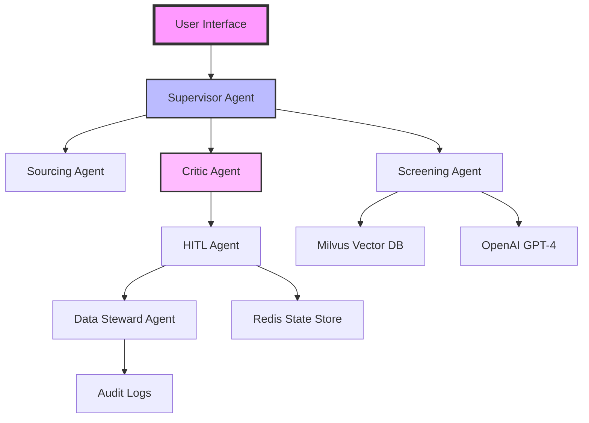

# Appendix

## Additional Resources

---

# Quick Reference: Key Talking Points

  <h3 class="text-blue-500">For Executives</h3>
  <ul>
    <li>ROI of $150K+ per 100 hires</li>
    <li>75% reduction in missed talent</li>
    <li>Competitive advantage through hidden talent pools</li>
  </ul>

  <h3 class="text-green-500">For HR Teams</h3>
  <ul>
    <li>90% time reduction</li>
    <li>Enhances (not replaces) human judgment</li>
    <li>Complete audit trail</li>
  </ul>

  <h3 class="text-purple-500">For Technical Audience</h3>
  <ul>
    <li>API-first architecture</li>
    <li>OpenAI GPT-4 + Milvus vector DB</li>
    <li>Cloud-native scalable design</li>
  </ul>

---

# Top 3 FAQs

<v-clicks>

## Q: How does this integrate with our ATS?
**A:** API-first design works with Workday, Greenhouse, Lever, and others. 2-week integration.

## Q: What about bias and compliance?
**A:** Built-in bias detection, full audit trail, GDPR/EEOC compliant, explainable AI decisions.

## Q: Implementation timeline?
**A:** 2-week pilot → 6-8 week full deployment. We handle everything.

</v-clicks>

---

# Technical Architecture

---

# Contact & Resources

## Get in Touch
- 📧 lelouvincx@gmail.com
- 🔗 github.com/lelouvincx/thesis
- 💼 LinkedIn: /in/lelouvincx

## Resources Available
- 📊 ROI Calculator
- 📄 Integration Guide
- 🎥 Demo Recording
- 📚 Technical Documentation
- 🧪 Pilot Program Details

  
Ready to transform your hiring process?

