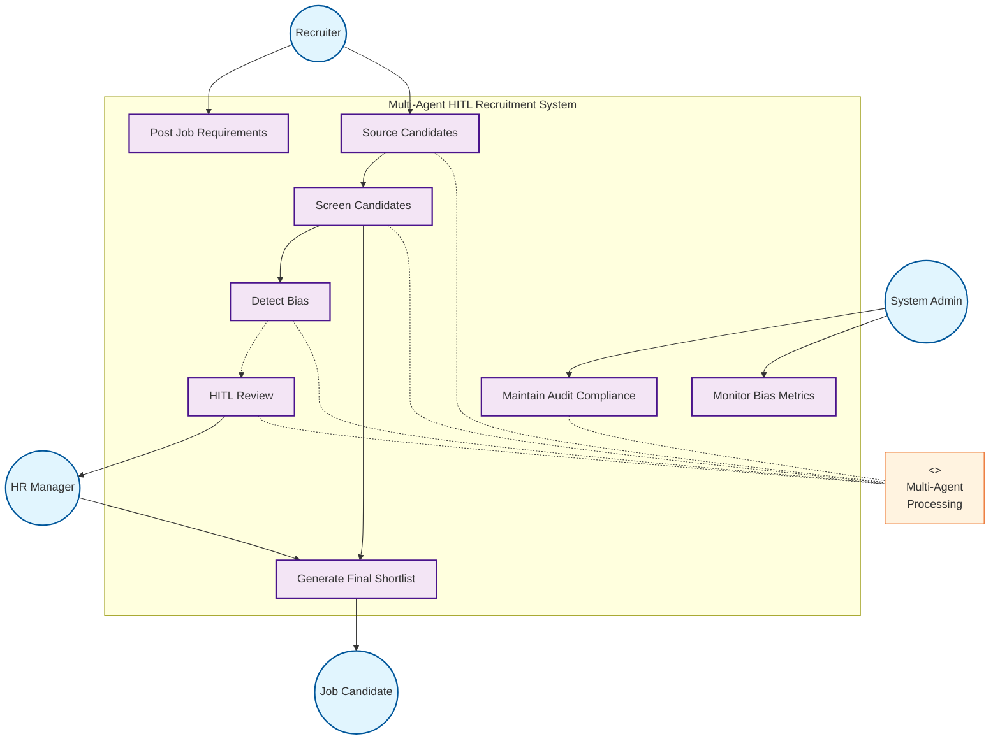

# Title Slide

<Toc minDepth="1" maxDepth="1" />

---

# Content Slide

---

## src: ./pages/appendix.md

---

# Use Case Diagram

<!--
- Job posting automatically triggers candidate sourcing
- All screening includes mandatory bias detection
- Low-confidence cases escalate to human review
- Complex reviews may require multiple discussion rounds
-->

<div class="flex justify-center items-center h-full">



</div>

---

# Test

```
┌─────────────────┐    ┌──────────────┐    ┌─────────────────┐
│   Chainlit UI   │────│    Agent     │────│   Vector Store  │
│  (Web Interface)│    │ (src/agents) │    │ (Milvus Lite)   │
└─────────────────┘    └──────────────┘    └─────────────────┘
                              │
                       ┌──────────────┐    ┌─────────────────┐
                       │  OpenAI API  │    │      Redis      │
                       │(LLM+Embeddings)│   │ (State Mgmt)    │
                       └──────────────┘    └─────────────────┘
```
