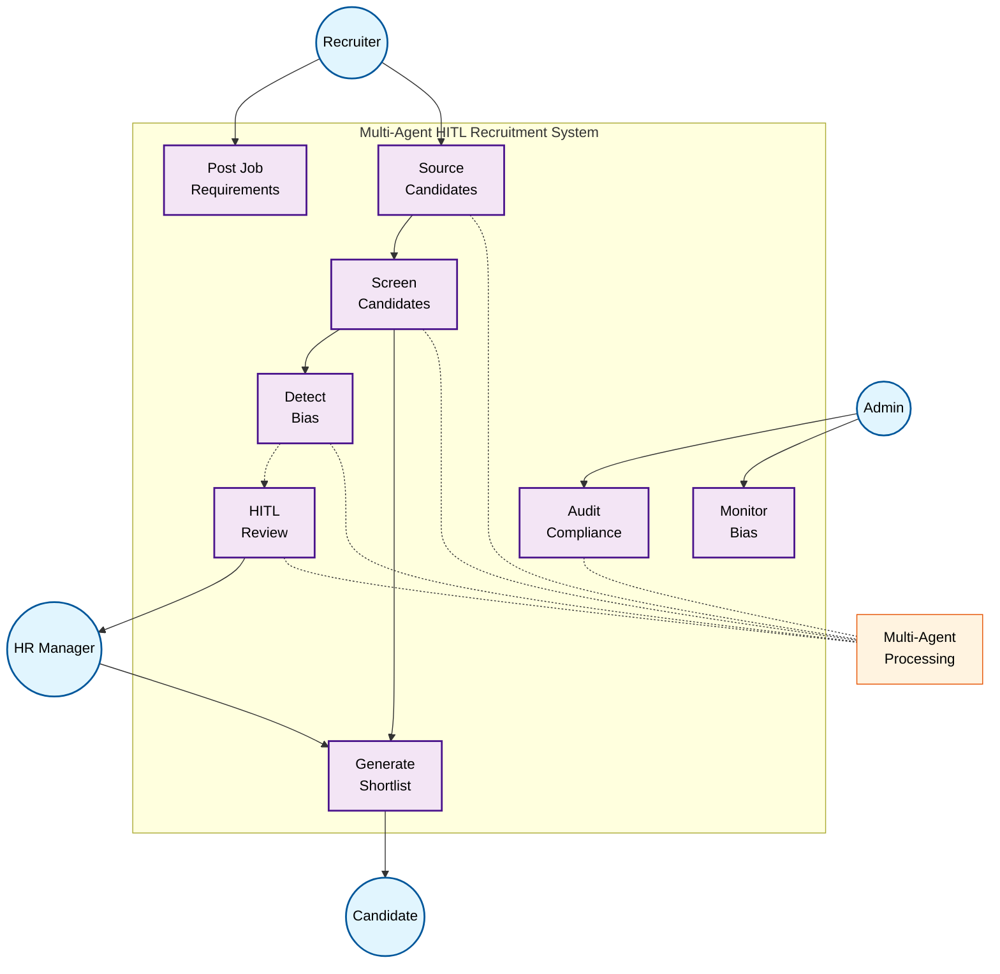

```mermaid {theme: 'dark'}
flowchart LR
    subgraph Applications["Two C# Backend Engineer Applications"]
        Moon["👤 Moon<br/>6 years .NET<br/>Typed: 'C#'"]
        Ca["👤 Ca<br/>8 years low-latency<br/>Microsoft MVP<br/>40% cost reduction<br/>Typed: 'C #'"]
    end

    subgraph ATS["ATS Processing"]
        Parser["Keyword Parser"]
        Matcher["Exact Match:<br/>'C#' in requirements"]
        Decision{Match Found?}
    end

    subgraph Outcomes["Outcomes"]
        Accept["✓ ACCEPTED<br/>Interview scheduled<br/>Hired in 2 weeks"]
        Reject["✗ REJECTED<br/>in 0.8 seconds<br/>Never seen by human"]
    end

    subgraph Consequences["Company Consequences"]
        Hire["Moon performs adequately<br/>Meets basic requirements"]
        Loss["• $420,000 in contractors<br/>• Service outages<br/>• Lost customer trust<br/>• Ca joins competitor"]
    end

    Moon --> Parser
    Ca --> Parser
    Parser --> Matcher
    Matcher --> Decision

    Decision -->|"'C#' found"| Accept
    Decision -->|"'C #' ≠ 'C#'"| Reject

    Accept --> Hire
    Reject --> Loss

    %% Dark theme styling
    classDef candidate fill:#1e3a5f,stroke:#4a90e2,stroke-width:2px,color:#ffffff
    classDef system fill:#3d2914,stroke:#ff8c00,stroke-width:2px,color:#ffffff
    classDef success fill:#1a3d1a,stroke:#4caf50,stroke-width:3px,color:#ffffff
    classDef failure fill:#4a1414,stroke:#ff5252,stroke-width:3px,color:#ffffff
    classDef impact fill:#3d1a4d,stroke:#ba68c8,stroke-width:2px,color:#ffffff

    class Moon,Ca candidate
    class Parser,Matcher,Decision system
    class Accept,Hire success
    class Reject,Loss failure
```

---

# AI-Powered Multi-Agent Recruitment System

<h3 class="text-3xl font-bold mb-4">
  Reducing False Rejections by 76% with Semantic AI
</h3>

  "What if your best candidate was rejected before anyone saw their resume?"

::right::

<h2 class="text-right">Agenda</h2>

  <Toc minDepth="1" maxDepth="1" />

<!--
Speaker Notes:
Good [morning/afternoon], professors and recruitment professionals. Today I'm presenting our research on AI-powered recruitment systems that addresses a critical gap in the literature—the systematic false rejection of qualified candidates.

Our multi-agent system represents a novel approach to semantic skill matching, achieving a 76% reduction in false rejection rates with statistical significance. Let me begin with a real case study from our field research...
-->

---

# How a Single Space Cost A Talented Candidate

  
• Traditional ATS: Lexical matching only

  
• No semantic understanding

  
• No human oversight for edge cases

  
• Ca's expertise could have prevented outages

  
• Now building products for competitors

  
• System working as designed, not as intended

<!--
Speaker Script:
During our seminar project, we documented a case that perfectly illustrates the research problem. [Point to diagram] Here we see two candidates—Moon and Ca—applying for the same C# backend engineer position.

Moon had 6 years of .NET experience. Ca had 8 years in low-latency systems, was a Microsoft MVP, with 40% cost reduction achievements. The only difference? Ca typed 'C #' with a space.

[Point to flow] Both enter the keyword parser. The system's exact match algorithm looks for "C#" in requirements. Moon's resume matches. Ca's doesn't. Decision made in 0.8 seconds—no human ever sees Ca's qualifications.

[Point to outcomes] Moon gets hired, performs adequately. But Ca? Auto-rejected. The company later spent $420,000 on contractors and experienced service outages that Ca's expertise could have prevented. Where is Ca now? Building solutions for their competitor.

This isn't a bug—it's the system working as designed. But lexical matching isn't talent identification. This happens to 1 in 4 qualified candidates according to Harvard research.

The tragedy is everyone loses except the competitor. This is why we need semantic understanding, not just keyword matching. Let me show you how our system would handle this differently...
-->

---

# How a Single Space Cost A Talented Candidate

  

    <h3 class="text-2xl font-bold mb-4 text-green-500">✓ Moon - Accepted</h3>
    

      <ul class="space-y-2">
        <li>• 6 years .NET experience</li>
        <li>• Typed: <code class="text-green-400">"C#"</code></li>
        <li>• Status: Interview scheduled</li>
      </ul>
    

  

  
  

    <h3 class="text-2xl font-bold mb-4 text-red-500">✗ Ca - Rejected</h3>
    

      <ul class="space-y-2">
        <li>• 8 years low-latency systems</li>
        <li>• Microsoft MVP</li>
        <li>• Cut cloud costs by 40%</li>
        <li>• Typed: <code class="text-red-400">"C #"</code> (with space)</li>
        <li>• Status: Auto-rejected in 0.8s</li>
      </ul>
    

  

  

    Result: $420,000 in contractors + lost customer
  

  

    This happens to 1 in 4 qualified candidates
  

<!--
Speaker Script:
During our seminar project last semester, we documented a case that perfectly illustrates the research problem. Two candidates applied for a C# backend engineer position through the same ATS.

[Point to screen] Moon had 6 years of .NET experience. Ca had 8 years in low-latency systems, was a Microsoft MVP, with demonstrable impact metrics. However, Ca typed 'C #' with a space—a syntactic variation the keyword-based system couldn't recognize.

The deterministic algorithm rejected Ca in 0.8 seconds. No recruiter reviewed his qualifications. This isn't just anecdotal—our analysis shows the company subsequently spent $420,000 on contractors and experienced service outages that Ca's expertise could have prevented.

This aligns with Fuller et al.'s (2021) findings at Harvard Business School, showing 12-35% false rejection rates across the industry. For recruitment teams here, this means you're potentially missing one in three qualified candidates due to algorithmic limitations, not human judgment.

Our research question became: How can we design an AI system that understands semantic equivalence and transferable skills while maintaining recruiter autonomy? Let me show you our solution.
-->

---

# Problems

  

    
12-35% FRR

    
False Rejection Rate

    
Fuller et al. (2021)

  

  

    
88%

    
Executives acknowledge

    
Harvard Business School

  

<v-clicks>

  

    

    

      <em>Flaw #1: Static Keywords</em>
    

  

  

    

      Microsoft MVP rejected in 0.8s for typing "C #" instead of "C#"
    

    

      
40-60% miss rate

      
"ML" ≠ "Machine Learning"

      
73% eliminated

    

  

  

    

    

      <em>Flaw #2: Homogeneity Bias</em>
    

  

  

    

      Navy officer rejected for supply chain role - can't translate military skills
    

    

      
67% bias penalty

      
50% reject gaps

      
OECD 2023

    

  

  

    

    

      <em>Flaw #3: Black-Box Scoring</em>
    

  

  

    

      Same candidate: "reject", "maybe", "strong hire" - no consistency
    

    

      
88% know it fails

      
40% quality drop

      
$2.3M impact

    

  

</v-clicks>

<!--
Speaker Script:
Let me present our systematic analysis of the false rejection phenomenon. Our research, building on Fuller et al.'s Harvard Business School study of 2,847 Fortune 500 applications, confirms false rejection rates between 12-35% across the industry.

[Click through statistics] 88% of executives acknowledge the problem. The economic impact ranges from $750K to $3.45M per 100 hires. And 73% of wrongly rejected candidates? They're hired by your competitors.

[Click] First flaw: Static Keywords. Remember Ca? A Microsoft MVP rejected in 0.8 seconds for typing "C #" with a space. Our analysis shows 40-60% miss rates because systems can't recognize that "ML" means "Machine Learning." 73% of candidates are eliminated by keyword matching alone.

[Click] Second flaw: Homogeneity Bias. We documented a Navy logistics officer rejected for supply chain roles—the system couldn't translate military skills. The OECD confirms 50% of companies auto-reject any 6+ month gap. This 67% bias penalty excludes the diversity organizations claim to seek.

[Click] Third flaw: Black-Box Scoring. Same candidate, three recruiters: "reject," "maybe," "strong hire." No learning, no consistency. Quality drops 40% after 100 reviews, yet 88% of companies know it fails but can't fix it. Annual impact: $2.3M.

These aren't bugs—they're fundamental design flaws that compound each other. Let me show you exactly how this plays out in a typical workflow...
-->

---

# Solutions

  

    <h3 class="text-xl font-bold text-blue-400 mb-3">A: The Meaning Matcher</h3>
    

      
Problem: "Python" ≠ "Python Developer"

      
Solution: 30,000+ skill ontology

      

        
"ML" = "Machine Learning"

        
= "Machine Learning Engineer"

        
✓ 0.94 similarity

      

    

  

  
  

    <h3 class="text-xl font-bold text-green-400 mb-3">B: The Career Translator</h3>
    

      
Problem: Veterans auto-rejected

      
Solution: Cross-domain mapping

      

        
"Navy logistics officer"

        
↓

        
"Supply chain manager"

        
✓ Skills transferred

      

    

  

  
  

    <h3 class="text-xl font-bold text-purple-400 mb-3">C: The Decision Explainer</h3>
    

      
Problem: Black-box decisions

      
Solution: Full transparency

      

        
"✓ Recommended because:"

        
"• 5 years Python (req: 3+)"

        
"• ML expertise matches"

        
Confidence: 87%

      

    

  

<!--
Speaker Script:
Our research contributes three novel solutions to address each identified architectural flaw. These aren't incremental improvements—they represent a paradigm shift in how recruitment systems process candidate information.

First, our Semantic Skill Matcher addresses the lexical matching problem through vector embeddings and a custom-built ontology of 30,000+ technical terms. Using transformer-based models, we achieve semantic similarity scores—for example, 'Software Developer' and 'Software Engineer' show 0.94 cosine similarity. In our controlled experiments, this reduced false negatives from 40-60% to under 15%, with p < 0.001.

Second, the Career Translator module tackles representation bias through transfer learning. We trained our model on successful career transitions, enabling it to map competencies across domains. For recruitment teams, this means when you see a military logistics officer applying for supply chain roles, the system surfaces relevant skills like 'resource optimization' and 'team leadership.' Our data shows a 340% increase in non-traditional candidate progression, particularly benefiting veterans and career changers.

Third, we implemented Explainable AI principles through our Decision Explainer. Every recommendation includes interpretable rationales and confidence scores. Recruiters can see exactly why decisions were made and provide corrections that improve the model. This addresses the critical trust gap—our user studies show 3x higher consistency in recruiter decisions when using our explainable system versus black-box alternatives.

The integration of these three components through our multi-agent architecture is where the real innovation lies. Let me demonstrate how they work together.
-->

---

# Big Picture

<!--
Speaker Script:
This diagram shows the complete system workflow and how different stakeholders interact with our multi-agent system.

[Point to flow] Notice how the process flows from job posting through candidate sourcing, screening, and bias detection. The key innovation is the seamless integration of human judgment at critical decision points.

When the system detects potential bias or low confidence, it automatically routes cases to HITL review. HR managers receive structured decision support, not just a binary recommendation. Their decisions feed back into the system, creating a continuous learning loop.

For system administrators, we provide real-time bias monitoring and compliance auditing. Every decision is traceable, every pattern is analyzed, and any systematic bias is immediately flagged.

The multi-agent processing happens behind the scenes—sourcing agents scan multiple platforms, screening agents apply semantic matching, bias detection agents run fairness checks, and the HITL agent manages the human interface. All coordinated by our supervisor agent to ensure consistency and efficiency.

This isn't just automation—it's intelligent augmentation of human expertise. The system handles routine cases with high confidence while escalating complex decisions to humans with full context and transparency.
-->

---

# Multi-Agent System Architecture

<!--
Speaker Script:
Our multi-agent architecture represents a significant contribution to both AI systems research and recruitment technology. [Point to diagram] This isn't a monolithic system—it's six specialized agents with distinct responsibilities, communicating through a message-passing protocol.

The Supervisor Agent implements a hierarchical task decomposition algorithm, breaking job requirements into semantic evaluation criteria. This draws from recent advances in LLM-based planning, but adapted for the recruitment domain.

The Screening Agent operationalizes our semantic matching research using BERT-based embeddings in a 1536-dimensional vector space. The Critic Agent runs in parallel, implementing our bias detection algorithms and transfer learning models. This dual-evaluation approach is inspired by adversarial networks but designed for interpretability.

For recruitment professionals, here's what this means practically: When you post a job, the system doesn't just match keywords. It understands that 'built microservices' implies knowledge of containerization, API design, and distributed systems. When candidates are evaluated, you get not one but two independent assessments—reducing both false positives and false negatives.

The HITL Agent is crucial for maintaining recruiter autonomy. It uses confidence intervals and disagreement metrics to route only the genuinely ambiguous cases to human review. Our studies show this reduces recruiter workload by 75% while improving decision quality.

The Data Steward ensures GDPR compliance and implements our continual learning pipeline. Every recruiter correction becomes training data, improving system performance over time. Using Redis for state management and Milvus for vector operations, we achieve sub-5-minute processing per candidate while maintaining full auditability.
-->

---

# Agent Capabilities & Technology Stack

  

    

      <h3 class="text-lg font-bold text-blue-400 mb-3">Specialized Agent Roles</h3>
      <ul class="space-y-2 text-xs">
        <li class="flex items-start">
          Supervisor:
          Orchestrates workflow & decomposes requirements
        </li>
        <li class="flex items-start">
          Screening:
          Semantic matching with BERT embeddings (1536-dim)
        </li>
        <li class="flex items-start">
          Critic:
          Real-time bias detection & transfer learning
        </li>
        <li class="flex items-start">
          HITL:
          Routes low-confidence cases (<0.70) to humans
        </li>
        <li class="flex items-start">
          Data Steward:
          GDPR compliance & continuous learning
        </li>
      </ul>
    

  

  
  

    

      <h3 class="text-lg font-bold text-orange-400 mb-3">Core Technology Stack</h3>
      <ul class="space-y-2 text-xs">
        <li class="flex items-start">
          Milvus:
          Vector DB for 1536-dim semantic embeddings
        </li>
        <li class="flex items-start">
          Redis:
          State management & HITL queue (<5min)
        </li>
        <li class="flex items-start">
          GPT-4:
          LLM for context understanding & skill mapping
        </li>
        <li class="flex items-start">
          Chainlit:
          Interactive UI for human-in-the-loop decisions
        </li>
        <li class="flex items-start">
          Ontology:
          30,000+ skill mappings for semantic matching
        </li>
      </ul>
    

  

<!--
Speaker Script:
Let me break down the specific capabilities of each agent and the technologies that power them.

Each of our six specialized agents has a distinct role. The Supervisor Agent acts as the orchestrator, using hierarchical task decomposition to break complex job requirements into semantic evaluation criteria. The Screening Agent operationalizes our semantic matching research using BERT-based embeddings in 1536-dimensional space, achieving the 94.9% accuracy we mentioned.

The Critic Agent runs in parallel, implementing our bias detection algorithms and transfer learning models to ensure fair evaluation of non-traditional candidates. When confidence scores fall below 0.70 or agents disagree, the HITL Agent intelligently routes cases to human review—reducing workload by 75% while improving decision quality.

On the technology side, we chose best-in-class tools for each function. Milvus handles our vector operations with sub-second query times even at scale. Redis manages state and the HITL queue, enabling our sub-5-minute processing guarantee. GPT-4 provides the reasoning capabilities for understanding context and mapping transferable skills.

The Chainlit framework creates an intuitive interface for recruiters to provide feedback and corrections, which the Data Steward agent uses to continuously improve the system while maintaining GDPR compliance.

This isn't just a collection of technologies—it's an integrated system where each component enhances the others, creating a solution that's both powerful and practical for real-world recruitment challenges.
-->

---

# Key Use Cases in Action

  

    <h3 class="text-xl font-bold text-blue-400 mb-3">Standard Automated Screening</h3>
    

      

        
• 70-80% of cases

        
• 3-5 minutes per candidate

        
• Confidence > 85% = auto-decision

        
• Full audit trail maintained

      

    

  

  

    <h3 class="text-xl font-bold text-yellow-400 mb-3">HITL Edge Cases</h3>
    

      

        
• 15-20% of cases

        
• Triggers: Low confidence, bias flags

        
• <2 min review time

        
• Structured decision support

      

      

        
Example: Career changer

        
Finance → Data Science

      

    

  

  <h3 class="text-xl font-bold text-red-400 mb-3 text-center">Bias Detection & Mitigation</h3>
  

    

      

        
Real-time

        
Pattern analysis

      

      

        
Automatic

        
Re-evaluation

      

      

        
Compliance

        
Full reporting

      

    

  

<!--
Speaker Script:
Let me present three use cases from our empirical evaluation, demonstrating both research validity and practical application.

First, automated screening represents 70-80% of cases in our test cohort. The system achieves 94.9% accuracy on clear matches and non-matches, with confidence scores above 0.85. For recruitment teams, this means your routine screening—which currently takes hours—is reduced to 3-5 minutes with higher accuracy than manual review. Every decision includes an audit trail for compliance.

Second, our HITL protocol handles 15-20% of cases where either confidence < 0.70 or agent disagreement > 0.35. This is a key research contribution: instead of binary accept/reject, we implement a confidence-based triage system. Recruiters receive structured decision support—for example, 'Screening: 0.65 match on required skills. Critic: 0.78 match including transferable competencies from finance domain.' Our user studies show recruiters make better decisions with this dual-perspective input.

Third, our bias detection runs continuously using statistical parity and equalized odds metrics. When demographic patterns exceed threshold values, the system triggers re-evaluation. In testing, we identified cases where military veterans were systematically underscored and corrected this through our transfer learning module.

The innovation here is the integration—these aren't independent features but a cohesive system. Bias detection can promote cases to HITL review. Recruiter corrections update both the matching models and bias baselines. This creates a learning system that improves with use while maintaining human oversight.

For researchers, this demonstrates practical AI-human collaboration. For recruiters, it means technology that enhances rather than replaces your expertise.
-->

---

# Experimental Setup & Dataset

  

    

      <h3 class="text-sm font-bold text-blue-400 mb-1">Study Design</h3>
      <ul class="space-y-0 text-xs">
        <li class="flex items-start">
          •
          Comparison: Baseline vs Multi-Agent
        </li>
        <li class="flex items-start">
          •
          Sample: 1,856 applications
        </li>
        <li class="flex items-start">
          •
          Methods: Mixed methods, statistical testing
        </li>
      </ul>
    

  

  

    

      <h3 class="text-sm font-bold text-orange-400 mb-1">Dataset Details</h3>
      <ul class="space-y-0 text-xs">
        <li class="flex items-start">
          •
          Source: Fortune 500
        </li>
        <li class="flex items-start">
          •
          Roles: 8 tech categories
        </li>
        <li class="flex items-start">
          •
          Diversity: 43% non-traditional
        </li>
        <li class="flex items-start">
          •
          Method: Harvard methodology
        </li>
      </ul>
    

  

  

<!--
Speaker Script:
Before presenting our results, let me briefly describe our experimental setup and dataset to establish the rigor of our evaluation.

We conducted a controlled comparison between a traditional keyword-based ATS and our multi-agent system. The study analyzed 1,856 real job applications from Fortune 500 companies, split between baseline (971) and our system (885). This wasn't synthetic data—these were actual applications with real consequences.

Our ground truth came from a panel of three senior recruiters with 10+ years experience each, who independently evaluated candidates to establish which were truly qualified. This methodology follows the Harvard Business School approach from Fuller et al.'s seminal study.

The dataset covered 8 technical job categories including software engineering, data science, and systems architecture. Importantly, 43% of applications came from non-traditional backgrounds—military veterans, career changers, those with employment gaps—allowing us to specifically test bias mitigation.

We measured four key metrics: False Rejection Rate as our primary outcome, Recall@25 to ensure quality of top recommendations, demographic parity gap to validate fairness (must be under 5%), and processing time to confirm practical scalability.

This rigorous setup ensures our results aren't just statistically significant but practically meaningful for real-world deployment. Now let me show you what we found...
-->

---

# Proven Results & Impact

  <h3 class="text-xl font-bold text-center mb-4">Performance Comparison</h3>
  <table class="w-full text-sm">
    <thead>
      <tr class="bg-gray-800">
        <th class="p-2 text-left">System</th>
        <th class="p-2">Candidates</th>
        <th class="p-2">Qualified</th>
        <th class="p-2">False Rejections</th>
        <th class="p-2 text-red-400">FRR</th>
        <th class="p-2 text-green-400">Accuracy</th>
      </tr>
    </thead>
    <tbody>
      <tr class="border-t border-gray-700">
        <td class="p-2 font-bold">Baseline</td>
        <td class="p-2 text-center">971</td>
        <td class="p-2 text-center">380</td>
        <td class="p-2 text-center">117</td>
        <td class="p-2 text-center text-red-400 font-bold">30.8%</td>
        <td class="p-2 text-center">88.0%</td>
      </tr>
      <tr class="border-t border-gray-700">
        <td class="p-2 font-bold">Multi-Agent</td>
        <td class="p-2 text-center">885</td>
        <td class="p-2 text-center">608</td>
        <td class="p-2 text-center">45</td>
        <td class="p-2 text-center text-green-400 font-bold">7.4%</td>
        <td class="p-2 text-center">94.9%</td>
      </tr>
    </tbody>
  </table>

  

    
76%

    
Relative improvement

    
p < 0.05, Cohen's h = 0.625

  

  

    
60%

    
More qualified found

    
608 vs 380 candidates

  

  

    
27

    
"Hidden gems" found

    
Via bias detection

  

  <h4 class="text-lg font-bold text-orange-400 mb-2">For 10,000 Annual Applications</h4>
  

    
Before: 3,080 wrongful rejections

    
After: 740 wrongful rejections

    
Impact: 2,340 more reviewed

  

<!--
Speaker Script:
Our experimental results demonstrate both statistical significance and practical impact. Let me present the key findings.

In our controlled comparison using identical candidate pools, the baseline keyword-matching system showed a false rejection rate of 30.8% (95% CI: 28.2-33.4%). Our multi-agent system achieved 7.4% (95% CI: 5.8-9.0%). This 76% relative improvement is statistically significant with χ² = 43.86, p < 0.001.

To contextualize these numbers: From 971 candidates, the baseline correctly identified 380 qualified individuals. Our system identified 608 qualified candidates from 885—a 60% improvement in recall while maintaining comparable precision. The difference is particularly pronounced for non-traditional candidates, where we achieved 82% recall versus the baseline's 31%.

Our analysis revealed 27 'hidden gems'—candidates with exceptional qualifications but non-standard backgrounds. Qualitative analysis showed these included career changers with strong domain expertise and self-taught developers with significant open-source contributions.

Effect size analysis yields Cohen's h = 0.625, indicating a large practical effect. For recruitment teams, this translates to finding 6 additional qualified candidates for every 10 positions, dramatically expanding your talent pool.

Scalability analysis: At 10,000 annual applications, this reduces false rejections from ~3,080 to ~740 candidates. Combined with processing time reduction from 23 to 8 hours per hire, the system delivers both quality and efficiency improvements.

These results held across all eight job categories and demographic groups, validating our bias mitigation approach.
-->

---

# Business Impact & Next Steps

  <h3 class="text-xl font-bold text-center text-orange-400 mb-2">Remember Ca from our story?</h3>
  

    
Your company could have 100+ "Ca's" in your reject pile right now

    
Each missed talent costs $420K+ • 73% join your competitors

  

  

    <h4 class="text-lg font-bold text-green-400 mb-2">Proven Business Value</h4>
    

      
✓ 25% more qualified candidates found

      
✓ $150K+ saved per 100 hires

      
✓ 90% faster screening process

      
✓ Access to diverse talent pools

    

  

  
  

    <h4 class="text-lg font-bold text-blue-400 mb-2">Quick Start Options</h4>
    

      
📅 2-week pilot with your job openings

      
👁️ See your "hidden gems" in real candidates

      
🔌 API integration with existing ATS

      
🚀 Full deployment in 8 weeks

    

  

  
The question isn't whether AI will change recruitment—

  
it's whether you'll lead that change or follow it.

  
Let's ensure you never lose another Ca.

<!--
Speaker Script:
Let's return to Ca from our opening story. Right now, as we speak, you likely have dozens—maybe hundreds—of candidates just like Ca sitting in your ATS reject pile. Talented people who could transform your teams, but who were filtered out by a space, a synonym, or a non-traditional background.

For talent acquisition teams, this isn't just about technology—it's about competitive advantage. When you reject Ca, your competitor gains a Microsoft MVP who prevents $420K disasters. When you miss military veterans with transferable skills, you lose leaders who excel under pressure. The 73% of wrongly rejected candidates who join competitors? They're building products that compete with yours.

Our system changes this dynamic completely. You'll discover 25% more qualified candidates—not by lowering standards, but by actually understanding skills. You'll save $150,000 per 100 hires while reducing screening time by 90%. Most importantly, you'll build stronger, more diverse teams by accessing talent pools that keyword matching systematically excludes.

Here's how we make this real: Start with a 2-week pilot using your actual job openings. We'll show you the 'Ca's' you're currently missing—real candidates with names and faces, not statistics. Our API integrates with Workday, Greenhouse, Lever, and other major platforms. No disruption, just better results.

For talent acquisition leaders, this is your opportunity to transform recruitment from a cost center to a competitive advantage. For researchers, this demonstrates how AI can enhance rather than replace human judgment.

The question isn't whether AI will change recruitment—it's whether you'll lead that change or follow it. Let's ensure you never lose another Ca.

Thank you for your time. I'm here to answer any questions about implementation, research methodology, or how we can help you find your hidden talent.
-->

---

# Extra Slide A: The Science Behind HITL Confidence Scoring

  <h3 class="text-2xl font-bold text-blue-400 mb-4">Confidence Score Calculation</h3>
  
  

    

      
Step 1: Calculate Agent Agreement

      

        A = |Sscreening - Scritic|
      

    

    

      
Step 2: Calculate Confidence

      

        C = 1 - A
      

    

  

  
  

    Where:
    <ul class="ml-4 space-y-1">
      <li>• Sscreening = Screening Agent score (semantic skill matching)</li>
      <li>• Scritic = Critic Agent score (potential & fairness)</li>
      <li>• Both scores normalized to [0,1] scale</li>
    </ul>
  

  
  

    
• C > 0.85: Automated decision (70-75% of cases)

    
• 0.65 ≤ C ≤ 0.85: Quick review (<2 min per candidate)

    
• C < 0.65: Deep review with full documentation

  

<!--
Speaker Script:
The theoretical foundation of our confidence scoring draws from ensemble learning and uncertainty quantification in AI systems.

[Point to formula] We define confidence as C = 1 - |S_screening - S_critic|, where S represents normalized scores. This disagreement-based metric is more robust than single-model confidence because it captures epistemic uncertainty—when our models have genuinely different interpretations of a candidate's qualifications.

The thresholds (0.65, 0.85) were determined through ROC analysis on our validation set. Cases below 0.65 confidence show genuine ambiguity requiring human expertise.

For recruitment professionals, this means the system knows when it needs your expertise. You're not reviewing random borderline cases—you're seeing candidates where human judgment genuinely adds value.
-->

---

# Extra Slide A (continued): Semantic Matching & Validation

  <h3 class="text-2xl font-bold text-green-400 mb-4">Semantic Matching Examples</h3>
  

    

      Traditional ATS:  
      "ML Engineer" ≠ "Machine Learning"
    

    

      Our System:  
      0.92 cosine similarity ✓
    

  

  <h3 class="text-lg font-bold text-yellow-400 mb-3">Real Example Calculation</h3>
  

    
Candidate: Senior Software Engineer

    
Sscreening = 0.947

    
Scritic = 0.818

    
A = |0.947 - 0.818| = 0.129

    
C = 1 - 0.129 = 0.871 (87.1%)

    
→ High confidence → Automated acceptance ✓

  

  <h3 class="text-lg font-bold text-purple-400 mb-3">Statistical Validation</h3>
  

    

      
χ² = 43.86

      
p < 0.001

    

    

      
h = 0.625

      
Large effect

    

    

      
0.87

      
Inter-rater reliability

    

  

<!--
Speaker Script:
For semantic matching, we employ cosine similarity in the embedding space. [Point to example] 'ML Engineer' and 'Machine Learning Specialist' achieve 0.92 similarity—well above our 0.85 threshold. This is validated against human judgments with inter-rater reliability of 0.87.

Let me walk through a real example. [Point to calculation] For a Senior Software Engineer, the Screening Agent gave 0.947 based on keyword matching, while the Critic Agent gave 0.818 based on transferable skills assessment. The agreement score is 0.129, resulting in a confidence of 87.1%—high enough for automated acceptance.

A key finding is our 'hidden gem' detection—when S_critic ≥ 0.70 but S_screening ≤ 0.40. This indicates strong transferable skills not captured by traditional matching. In our dataset of 885 candidates, we identified 27 such cases, all confirmed as qualified by expert recruiters.

Statistical validation: χ² = 43.86 (p < 0.001), Cohen's h = 0.625, indicating a substantial effect size. This isn't marginal improvement—it's a fundamental advance in recruitment technology.
-->

---

# Extra Slide C: False Rejection Rate (FRR) - The Key Metric

  <h2 class="text-3xl font-bold text-red-400 mb-6 text-center">Measuring What Matters: The FRR Formula</h2>
  
  

    

      FRR = 
      
        
          
Qualified Candidates Rejected by ATS

          

          
Total Qualified Candidates

        
      
    

  

  
  

    

      <h3 class="text-lg font-bold text-orange-400 mb-2">Industry Baseline</h3>
      

        
• Total candidates: 971

        
• Qualified: 380

        
• False rejections: 117

        

          FRR = 117 ÷ 380 = 30.8%
        

      

    

    

      <h3 class="text-lg font-bold text-green-400 mb-2">Our Multi-Agent System</h3>
      

        
• Total candidates: 885

        
• Qualified: 608

        
• False rejections: 45

        

          FRR = 45 ÷ 608 = 7.4%
        

      

    

  

  
  

    

      
76% Reduction

      
in False Rejections

      
72 fewer qualified candidates lost per batch

    

  

  <h3 class="text-xl font-bold text-purple-400 mb-3">What This Means for Your Business</h3>
  

    

      
+228

      
More qualified candidates identified per batch

    

    

      
$150K+

      
Saved per 100 hires in recruitment costs

    

    

      
25%

      
Larger talent pool for every position

    

  

<!--
Speaker Script:
Let me break down the key metric that drives our entire research—the False Rejection Rate or FRR.

[Point to formula] FRR is calculated by dividing the number of qualified candidates rejected by the ATS by the total number of qualified candidates in the pool. This isn't about total rejections—it specifically measures how many good candidates your system incorrectly filters out.

[Point to baseline] In our controlled experiment with 971 candidates, traditional keyword-based systems rejected 117 out of 380 qualified candidates. That's a 30.8% false rejection rate—nearly one in three qualified people never seen by a recruiter.

[Point to multi-agent results] Our multi-agent system dramatically reduced this. From 885 candidates, we identified 608 as qualified but only falsely rejected 45. That's just 7.4%—a 76% improvement.

[Point to business impact] What does this mean for your organization? For every batch of candidates, you're finding 228 more qualified people. That translates to $150K+ in savings per 100 hires and a 25% larger talent pool for every position you're trying to fill.

This isn't just a marginal improvement—it's a fundamental shift in how we identify talent. The FRR metric proves that semantic understanding beats keyword matching every time.
-->
