---
layout: two-cols
---

# AI-Powered Multi-Agent Recruitment System

<h3 class="text-3xl font-bold mb-4">
  Reducing False Rejections by 76% with Semantic AI
</h3>

  "What if your best candidate was rejected before anyone saw their resume?"

::right::

<h2 class="text-right">Agenda</h2>

  <Toc minDepth="1" maxDepth="1" />

<!--
Speaker Notes:
Good [morning/afternoon], professors and recruitment professionals. Today I'm presenting our research on AI-powered recruitment systems that addresses a critical gap in the literature—the systematic false rejection of qualified candidates.

Our multi-agent system represents a novel approach to semantic skill matching, achieving a 76% reduction in false rejection rates with statistical significance. Let me begin with a real case study from our field research...
-->

---

# How a Single Space Cost $420,000

  

    <h3 class="text-2xl font-bold mb-4 text-green-500">✓ Moon - Accepted</h3>
    

      <ul class="space-y-2">
        <li>• 6 years .NET experience</li>
        <li>• Typed: <code class="text-green-400">"C#"</code></li>
        <li>• Status: Interview scheduled</li>
      </ul>
    

  

  
  

    <h3 class="text-2xl font-bold mb-4 text-red-500">✗ Ca - Rejected</h3>
    

      <ul class="space-y-2">
        <li>• 8 years low-latency systems</li>
        <li>• Microsoft MVP</li>
        <li>• Cut cloud costs by 40%</li>
        <li>• Typed: <code class="text-red-400">"C #"</code> (with space)</li>
        <li>• Status: Auto-rejected in 0.8s</li>
      </ul>
    

  

  

    Result: $420,000 in contractors + lost customer
  

  

    This happens to 1 in 3 qualified candidates
  

<!--
Speaker Script:
During our seminar project last semester, we documented a case that perfectly illustrates the research problem. Two candidates applied for a C# backend engineer position through the same ATS.

[Point to screen] Moon had 6 years of .NET experience. Ca had 8 years in low-latency systems, was a Microsoft MVP, with demonstrable impact metrics. However, Ca typed 'C #' with a space—a syntactic variation the keyword-based system couldn't recognize.

The deterministic algorithm rejected Ca in 0.8 seconds. No recruiter reviewed his qualifications. This isn't just anecdotal—our analysis shows the company subsequently spent $420,000 on contractors and experienced service outages that Ca's expertise could have prevented.

This aligns with Fuller et al.'s (2021) findings at Harvard Business School, showing 12-35% false rejection rates across the industry. For recruitment teams here, this means you're potentially missing one in three qualified candidates due to algorithmic limitations, not human judgment.

Our research question became: How can we design an AI system that understands semantic equivalence and transferable skills while maintaining recruiter autonomy? Let me show you our solution.
-->

---

# The Hidden Talent Crisis

  

    

      

        
12-35% FRR

        
False Rejection Rate across industry

      

      
Harvard Business School 2021

    

  

  
  

    

      

        
88%

        
Executives acknowledge the problem

      

      
&nbsp;

    

  

  
  

    

      

        
$750K-$3.45M

        
Annual cost per 100 hires

      

      
&nbsp;

    

  

  
  

    

      

        
73%

        
Rejected candidates hired by competitors

      

      
&nbsp;

    

  

<!--
Speaker Script:
Let me present our systematic analysis of the false rejection phenomenon. Our literature review, building on Fuller et al. (2021) and OECD Employment Outlook (2023), confirms false rejection rates between 12-35% across different ATS implementations. This represents a significant gap between recruiter intentions and system outcomes.

88% of executives acknowledge that their screening technology is filtering out qualified candidates. The economic impact—$750K to $3.45M per 100 hires—reflects not just delayed hiring but missed talent opportunities. And 73% of those wrongly rejected candidates? They're getting hired by your competitors.

From a research perspective, we've identified critical patterns that explain these failures. Let me show you the three fundamental flaws we discovered...
-->

---

# Three Systemic Design Flaws

Why current ATS systems fail qualified candidates

<v-clicks>

  

    

    

      <em>Static Keywords</em>
    

  

  

    

      Lexical matching without semantic understanding - can't recognize that "Python Developer" and "Python Programming" are equivalent
    

    

      
40-60% miss rate

      
"ML" ≠ "Machine Learning"

      
"Sr." ≠ "Senior"

      
Context ignored

    

  

  

    

    

      <em>Homogeneity Bias</em>
    

  

  

    

      Encoded bias against non-linear career paths - the diversity organizations seek is filtered out by their tools
    

    

      
67% bias penalty

      
6+ month gaps rejected

      
Military → Civilian bias

      
Career changers excluded

    

  

  

    

    

      <em>Black-Box Scoring</em>
    

  

  

    

      No transparency or explainability - recruiters can't understand why decisions were made or correct errors
    

    

      
Random outcomes

      
Same resume, different scores

      
No audit trail

      
Can't override

    

  

</v-clicks>

<!--
Speaker Script:
Our research identified three fundamental architectural flaws that create these massive false rejection rates.

First, Static Keywords. [Click] Current systems use lexical matching—they literally look for exact text matches. They can't understand that "Python" and "Python Developer" refer to the same competency. This creates a 40-60% miss rate for qualified candidates who use slightly different terminology. It's like rejecting someone who says "car" when you're looking for "automobile."

Second, Homogeneity Bias. [Click] These algorithms encode societal biases against non-traditional backgrounds. Career gaps? Automatic rejection. Military to civilian transition? 67% higher rejection rate. The very diversity companies claim to want is systematically filtered out by their tools.

Third, Black-Box Scoring. [Click] No transparency, no explainability. The same resume submitted twice can get different scores. Recruiters can't understand why decisions were made or correct obvious errors. This violates basic principles of explainable AI and creates random, unfair outcomes.

These aren't bugs—they're fundamental design flaws. And they compound each other. Let me show you exactly how this plays out in a typical screening workflow...
-->

---

# Where Qualified Candidates Get Lost

```mermaid
flowchart LR
    %% Probability tracking
    Start([Job Posted<br/>250 Applications]) --> Submit[Resume Submitted<br/>100% Pool]

    Submit --> Parse{Tokenisation<br/>PDF → Text<br/>E₁: Error}
    Parse -->|Success<br/>82.7%| Extract[Keyword Extract<br/>207 candidates]
    Parse -->|Fail<br/>17.3%| RejectParse[AUTO-REJECT<br/>Parse Error E₁<br/>43 excluded]

    Extract --> Screen{Boolean Filter<br/>E₂: False Negatives}

    Screen -->|Pass<br/>57%| Rank[Ranking<br/>118 candidates]
    Screen -->|Fail<br/>43%| RejectScreen[AUTO-REJECT<br/>Boolean E₂<br/>89 excluded<br/>40-60% qualified]

    Rank --> Threshold{Top 15%<br/>E₃: Bias}
    Threshold -->|Above| Human[Human Review<br/>18 candidates]
    Threshold -->|Below| RejectThreshold[AUTO-REJECT<br/>Cutoff E₃<br/>100 excluded]

    Human --> Final{Final Decision<br/>Fatigue Factor}
    Final -->|Hire<br/>22%| Accept[ACCEPTED<br/>4 hires]
    Final -->|Reject<br/>78%| RejectFinal[REJECTED<br/>14 excluded]

    %% Highlight critical failure points with Harvard study findings
    RejectScreen -.->|Contains| QualifiedPool[Harvard Finding:<br/>30-53 qualified<br/>wrongly excluded]

    %% Design flaw annotations with Section references
    Extract -.->|Flaw #1| StaticKeywords[Keyword Errors:<br/>'Developer' ≠ 'Engineer'<br/>'ML' ≠ 'Machine Learning']

    Screen -.->|Flaw #2| HomogeneityBias[Bias Issues:<br/>6+ month gaps rejected<br/>Military → Civilian bias]

    Human -.->|Flaw #3| BlackBox[Fatigue:<br/>Quality drops 40%<br/>after 100 reviews]

    %% Color-blind friendly styling (WCAG 2.1 AA compliant)
    classDef rejectNode fill:#ffe6e6,stroke:#D55E00,stroke-width:2px,color:#000
    classDef acceptNode fill:#e6f3e6,stroke:#0072B2,stroke-width:2px,color:#000
    classDef processNode fill:#e6f0ff,stroke:#0072B2,stroke-width:2px,color:#000
    classDef decisionNode fill:#fff5e6,stroke:#D55E00,stroke-width:2px,color:#000
    classDef flawNode fill:#f0f0f0,stroke:#999999,stroke-width:1px,stroke-dasharray: 3 3,color:#000
    classDef statsNode fill:#f5e6ff,stroke:#6a1b9a,stroke-width:2px,color:#000

    class RejectParse,RejectScreen,RejectThreshold,RejectFinal rejectNode
    class Accept acceptNode
    class Submit,Extract,Rank processNode
    class Parse,Screen,Threshold,Final decisionNode
    class StaticKeywords,HomogeneityBias,BlackBox flawNode
    class QualifiedPool statsNode
```

<!--
Speaker Script:
[Point to diagram] This workflow diagram, based on our analysis of 250 real applications, illustrates three critical failure points. Notice how tokenization errors (E₁), Boolean false negatives (E₂), and ranking cutoffs (E₃) compound to reduce the candidate pool from 250 to just 18—a 93% reduction. Our statistical analysis indicates 30-53 qualified candidates are eliminated through these systematic errors.

For recruitment professionals, this creates an impossible situation: you're held accountable for hiring quality, yet the tools meant to help you are actively working against you. 

These findings led us to propose a fundamentally different architecture based on multi-agent systems and semantic understanding.
-->

---

# Our Three Core Solutions

  

    <h3 class="text-xl font-bold text-blue-400 mb-3">A: The Meaning Matcher</h3>
    

      
Problem: "Python" ≠ "Python Developer"

      
Solution: 30,000+ skill ontology

      
Impact: 40-60% → <15% miss rate

      

        
"ML" = "Machine Learning"

        
= "Machine Learning Engineer"

        
✓ 0.94 similarity

      

    

  

  
  

    <h3 class="text-xl font-bold text-green-400 mb-3">B: The Career Translator</h3>
    

      
Problem: Veterans auto-rejected

      
Solution: Cross-domain mapping

      
Impact: 340% veteran acceptance ↑

      

        
"Navy logistics officer"

        
↓

        
"Supply chain manager"

        
✓ Skills transferred

      

    

  

  
  

    <h3 class="text-xl font-bold text-purple-400 mb-3">C: The Decision Explainer</h3>
    

      
Problem: Black-box decisions

      
Solution: Full transparency

      
Impact: 3× consistency

      

        
"✓ Recommended because:"

        
"• 5 years Python (req: 3+)"

        
"• ML expertise matches"

        
Confidence: 87%

      

    

  

<!--
Speaker Script:
Our research contributes three novel solutions to address each identified architectural flaw. These aren't incremental improvements—they represent a paradigm shift in how recruitment systems process candidate information.

First, our Semantic Skill Matcher addresses the lexical matching problem through vector embeddings and a custom-built ontology of 30,000+ technical terms. Using transformer-based models, we achieve semantic similarity scores—for example, 'Software Developer' and 'Software Engineer' show 0.94 cosine similarity. In our controlled experiments, this reduced false negatives from 40-60% to under 15%, with p < 0.001.

Second, the Career Translator module tackles representation bias through transfer learning. We trained our model on successful career transitions, enabling it to map competencies across domains. For recruitment teams, this means when you see a military logistics officer applying for supply chain roles, the system surfaces relevant skills like 'resource optimization' and 'team leadership.' Our data shows a 340% increase in non-traditional candidate progression, particularly benefiting veterans and career changers.

Third, we implemented Explainable AI principles through our Decision Explainer. Every recommendation includes interpretable rationales and confidence scores. Recruiters can see exactly why decisions were made and provide corrections that improve the model. This addresses the critical trust gap—our user studies show 3x higher consistency in recruiter decisions when using our explainable system versus black-box alternatives.

The integration of these three components through our multi-agent architecture is where the real innovation lies. Let me demonstrate how they work together.
-->

---

# Multi-Agent System Architecture

```mermaid
graph LR
    %% Human Actors & Interfaces
    A[Recruiter] -->|"1 - Job Requirements"| AgentCoreSystem
    C[HR Manager / Reviewer] -->|"10 - Human Decision"| D{HITL UI}
    D -->|"Feedback & Corrections"| AgentCoreSystem

    %% AgentCore System with all agents
    subgraph AgentCoreSystem["AgentCore Multi-Agent System"]
        %% Multi-Agent System Core
        B[Supervisor Agent]
        F[Sourcing Subagent]
        G[Screening Subagent]
        H[Critic Subagent]
        E[HITL Subagent]
        P[Data-Steward Subagent]

        %% Internal Agent Communications
        B -->|"2 - Candidate Search Task"| F
        B -->|"5 - Evaluation Task"| G
        B -->|"7 - Second Opinion Request"| H
        B -->|"9 - Human Review Request"| E

        G -->|"6 - Screening Scores"| B
        H -->|"8 - Bias Assessment"| B
        E -->|"11 - Human Validated Decision"| B

        %% Logging connections
        B -->|"Orchestration Logs"| P
        G -->|"Evaluation Logs"| P
        H -->|"Bias Detection Logs"| P
        E -->|"Human Decision Logs"| P
    end

    AgentCoreSystem -->|"12 - Final Recommendations"| A

    %% Data & Knowledge Layer
    K[(Candidate Pool Database)] -->|"Resume Data"| AgentCoreSystem
    L[(Vector Database)] -->|"Semantic Embeddings"| AgentCoreSystem
    M{{Prompt Libraries}} -->|"Agent Instructions"| AgentCoreSystem
    N{{Guardrails}} -->|"Safety Constraints"| AgentCoreSystem
    O[(Persistent Memory)] <-->|"Learning & Metrics"| AgentCoreSystem
    J[(Ephemeral Memory)] <-->|"Session State"| AgentCoreSystem

    %% External Systems
    I(Tools / APIs <br> Job Boards, Prof. Networks)

    %% External connections
    AgentCoreSystem -->|"3 - Candidate Queries"| I
    AgentCoreSystem -->|"4 - Store Candidates"| K
    AgentCoreSystem -->|"Model Updates"| O

    %% Styling
    classDef human fill:#e3f2fd,stroke:#333
    classDef agent fill:#e8f5e9,stroke:#388e3c
    classDef data fill:#fff3e0,stroke:#f57c00
    classDef external fill:#f3e5f5,stroke:#7b1fa2
    classDef interface fill:#e0f7fa,stroke:#00796b
    classDef agentCore fill:#e8eaf6,stroke:#3f51b5,stroke-width:3px

    class A,C human
    class B,F,G,H,E,P agent
    class K,L,M,N,O,J data
    class I external
    class D interface
    class AgentCoreSystem agentCore
```

  

    <h4 class="font-bold text-green-400 mb-2">Specialized Agents:</h4>
    <ul class="space-y-1 text-xs">
      <li>• Supervisor: Orchestrates workflow</li>
      <li>• Screening: Semantic matching</li>
      <li>• Critic: Bias detection</li>
      <li>• HITL: Human review routing</li>
    </ul>
  

  

    <h4 class="font-bold text-orange-400 mb-2">Key Technologies:</h4>
    <ul class="space-y-1 text-xs">
      <li>• Milvus: 1536-dim vectors</li>
      <li>• Redis: State management</li>
      <li>• GPT-4: LLM reasoning</li>
      <li>• Chainlit: UI framework</li>
    </ul>
  

<!--
Speaker Script:
Our multi-agent architecture represents a significant contribution to both AI systems research and recruitment technology. [Point to diagram] This isn't a monolithic system—it's six specialized agents with distinct responsibilities, communicating through a message-passing protocol.

The Supervisor Agent implements a hierarchical task decomposition algorithm, breaking job requirements into semantic evaluation criteria. This draws from recent advances in LLM-based planning, but adapted for the recruitment domain.

The Screening Agent operationalizes our semantic matching research using BERT-based embeddings in a 1536-dimensional vector space. The Critic Agent runs in parallel, implementing our bias detection algorithms and transfer learning models. This dual-evaluation approach is inspired by adversarial networks but designed for interpretability.

For recruitment professionals, here's what this means practically: When you post a job, the system doesn't just match keywords. It understands that 'built microservices' implies knowledge of containerization, API design, and distributed systems. When candidates are evaluated, you get not one but two independent assessments—reducing both false positives and false negatives.

The HITL Agent is crucial for maintaining recruiter autonomy. It uses confidence intervals and disagreement metrics to route only the genuinely ambiguous cases to human review. Our studies show this reduces recruiter workload by 75% while improving decision quality.

The Data Steward ensures GDPR compliance and implements our continual learning pipeline. Every recruiter correction becomes training data, improving system performance over time. Using Redis for state management and Milvus for vector operations, we achieve sub-5-minute processing per candidate while maintaining full auditability.
-->

---

# Key Use Cases in Action

  

    <h3 class="text-xl font-bold text-blue-400 mb-3">Standard Automated Screening</h3>
    

      

        
• 70-80% of cases

        
• 3-5 minutes per candidate

        
• Confidence > 85% = auto-decision

        
• Full audit trail maintained

      

      

        
94.9%

        
Accuracy on clear matches

      

    

  

  

    <h3 class="text-xl font-bold text-yellow-400 mb-3">HITL Edge Cases</h3>
    

      

        
• 15-20% of cases

        
• Triggers: Low confidence, bias flags

        
• <2 min review time

        
• Structured decision support

      

      

        
Example: Career changer

        
Finance → Data Science

      

    

  

  <h3 class="text-xl font-bold text-red-400 mb-3 text-center">Bias Detection & Mitigation</h3>
  

    

      

        
Real-time

        
Pattern analysis

      

      

        
Automatic

        
Re-evaluation

      

      

        
Compliance

        
Full reporting

      

    

  

<!--
Speaker Script:
Let me present three use cases from our empirical evaluation, demonstrating both research validity and practical application.

First, automated screening represents 70-80% of cases in our test cohort. The system achieves 94.9% accuracy on clear matches and non-matches, with confidence scores above 0.85. For recruitment teams, this means your routine screening—which currently takes hours—is reduced to 3-5 minutes with higher accuracy than manual review. Every decision includes an audit trail for compliance.

Second, our HITL protocol handles 15-20% of cases where either confidence < 0.70 or agent disagreement > 0.35. This is a key research contribution: instead of binary accept/reject, we implement a confidence-based triage system. Recruiters receive structured decision support—for example, 'Screening: 0.65 match on required skills. Critic: 0.78 match including transferable competencies from finance domain.' Our user studies show recruiters make better decisions with this dual-perspective input.

Third, our bias detection runs continuously using statistical parity and equalized odds metrics. When demographic patterns exceed threshold values, the system triggers re-evaluation. In testing, we identified cases where military veterans were systematically underscored and corrected this through our transfer learning module.

The innovation here is the integration—these aren't independent features but a cohesive system. Bias detection can promote cases to HITL review. Recruiter corrections update both the matching models and bias baselines. This creates a learning system that improves with use while maintaining human oversight.

For researchers, this demonstrates practical AI-human collaboration. For recruiters, it means technology that enhances rather than replaces your expertise.
-->

---

# Proven Results & Impact

  <h3 class="text-xl font-bold text-center mb-4">Performance Comparison</h3>
  <table class="w-full text-sm">
    <thead>
      <tr class="bg-gray-800">
        <th class="p-2 text-left">System</th>
        <th class="p-2">Candidates</th>
        <th class="p-2">Qualified</th>
        <th class="p-2">False Rejections</th>
        <th class="p-2 text-red-400">FRR</th>
        <th class="p-2 text-green-400">Accuracy</th>
      </tr>
    </thead>
    <tbody>
      <tr class="border-t border-gray-700">
        <td class="p-2 font-bold">Baseline</td>
        <td class="p-2 text-center">971</td>
        <td class="p-2 text-center">380</td>
        <td class="p-2 text-center">117</td>
        <td class="p-2 text-center text-red-400 font-bold">30.8%</td>
        <td class="p-2 text-center">88.0%</td>
      </tr>
      <tr class="border-t border-gray-700">
        <td class="p-2 font-bold">Multi-Agent</td>
        <td class="p-2 text-center">885</td>
        <td class="p-2 text-center">608</td>
        <td class="p-2 text-center">45</td>
        <td class="p-2 text-center text-green-400 font-bold">7.4%</td>
        <td class="p-2 text-center">94.9%</td>
      </tr>
    </tbody>
  </table>

  

    
76%

    
Relative improvement

    
p < 0.05, Cohen's h = 0.625

  

  

    
60%

    
More qualified found

    
608 vs 380 candidates

  

  

    
27

    
"Hidden gems" found

    
Via bias detection

  

  <h4 class="text-lg font-bold text-orange-400 mb-2">For 10,000 Annual Applications</h4>
  

    
Before: 3,080 wrongful rejections

    
After: 740 wrongful rejections

    
Impact: 2,340 more reviewed

  

<!--
Speaker Script:
Our experimental results demonstrate both statistical significance and practical impact. Let me present the key findings.

In our controlled comparison using identical candidate pools, the baseline keyword-matching system showed a false rejection rate of 30.8% (95% CI: 28.2-33.4%). Our multi-agent system achieved 7.4% (95% CI: 5.8-9.0%). This 76% relative improvement is statistically significant with χ² = 43.86, p < 0.001.

To contextualize these numbers: From 971 candidates, the baseline correctly identified 380 qualified individuals. Our system identified 608 qualified candidates from 885—a 60% improvement in recall while maintaining comparable precision. The difference is particularly pronounced for non-traditional candidates, where we achieved 82% recall versus the baseline's 31%.

Our analysis revealed 27 'hidden gems'—candidates with exceptional qualifications but non-standard backgrounds. Qualitative analysis showed these included career changers with strong domain expertise and self-taught developers with significant open-source contributions.

Effect size analysis yields Cohen's h = 0.625, indicating a large practical effect. For recruitment teams, this translates to finding 6 additional qualified candidates for every 10 positions, dramatically expanding your talent pool.

Scalability analysis: At 10,000 annual applications, this reduces false rejections from ~3,080 to ~740 candidates. Combined with processing time reduction from 23 to 8 hours per hire, the system delivers both quality and efficiency improvements.

These results held across all eight job categories and demographic groups, validating our bias mitigation approach.
-->

---

# Business Impact & Next Steps

  <h3 class="text-xl font-bold text-center text-orange-400 mb-2">Remember Ca from our story?</h3>
  

    
Your company could have 100+ "Ca's" in your reject pile right now

    
Each missed talent costs $420K+ • 73% join your competitors

  

  

    <h4 class="text-lg font-bold text-green-400 mb-2">Proven Business Value</h4>
    

      
✓ 25% more qualified candidates found

      
✓ $150K+ saved per 100 hires

      
✓ 90% faster screening process

      
✓ Access to diverse talent pools

    

  

  
  

    <h4 class="text-lg font-bold text-blue-400 mb-2">Quick Start Options</h4>
    

      
📅 2-week pilot with your job openings

      
👁️ See your "hidden gems" in real candidates

      
🔌 API integration with existing ATS

      
🚀 Full deployment in 8 weeks

    

  

  
The question isn't whether AI will change recruitment—

  
it's whether you'll lead that change or follow it.

  
Let's ensure you never lose another Ca.

<!--
Speaker Script:
Let's return to Ca from our opening story. Right now, as we speak, you likely have dozens—maybe hundreds—of candidates just like Ca sitting in your ATS reject pile. Talented people who could transform your teams, but who were filtered out by a space, a synonym, or a non-traditional background.

For talent acquisition teams, this isn't just about technology—it's about competitive advantage. When you reject Ca, your competitor gains a Microsoft MVP who prevents $420K disasters. When you miss military veterans with transferable skills, you lose leaders who excel under pressure. The 73% of wrongly rejected candidates who join competitors? They're building products that compete with yours.

Our system changes this dynamic completely. You'll discover 25% more qualified candidates—not by lowering standards, but by actually understanding skills. You'll save $150,000 per 100 hires while reducing screening time by 90%. Most importantly, you'll build stronger, more diverse teams by accessing talent pools that keyword matching systematically excludes.

Here's how we make this real: Start with a 2-week pilot using your actual job openings. We'll show you the 'Ca's' you're currently missing—real candidates with names and faces, not statistics. Our API integrates with Workday, Greenhouse, Lever, and other major platforms. No disruption, just better results.

For talent acquisition leaders, this is your opportunity to transform recruitment from a cost center to a competitive advantage. For researchers, this demonstrates how AI can enhance rather than replace human judgment.

The question isn't whether AI will change recruitment—it's whether you'll lead that change or follow it. Let's ensure you never lose another Ca.

Thank you for your time. I'm here to answer any questions about implementation, research methodology, or how we can help you find your hidden talent.
-->

---