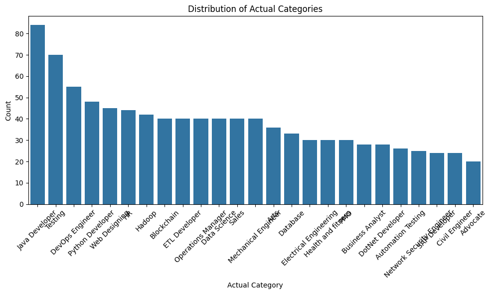

# Chapter 5: Implementation and Evaluation

## 5.1 Data Preparation

### Dataset Overview

We employ a unified resume dataset comprising **1,182 expert-labeled records** from various sources, manually annotated by HR professionals and recruitment specialists. The dataset covers eight technology roles:

- Frontend Developer
- Backend Developer
- Python Developer
- Data Scientist
- Full Stack Developer
- Mobile App Developer (iOS/Android)
- Machine Learning Engineer
- Cloud Engineer

Each resume contains unstructured natural language text mirroring real-world job applications, including education, skills, experience, projects, and certifications.

### Selection Rationale

This dataset aligns with our research objectives for the following reasons:

1. **Expert Annotation**: HR professionals provide reliable ground truth labels
2. **Statistical Power**: 1,182 samples enable meaningful performance evaluation
3. **Balanced Coverage**: ~148 resumes per job category ensure unbiased assessment
4. **Real-World Validity**: Authentic formats and content variations reflect actual recruitment scenarios
5. **False Rejection Analysis**: Sufficient diversity to identify patterns where traditional systems fail

### Dataset Characteristics

| **Metric**       | **Value**                                        |
| ---------------- | ------------------------------------------------ |
| Total Records    | 1,182 expert-labeled resumes                     |
| Per Category     | ~148 resumes (balanced)                          |
| Resume Length    | 200-2,000 words (avg: 600)                       |
| Technical Skills | 15-20 per resume                                 |
| Experience Range | 0-10+ years                                      |
| Education        | Bachelor's (65%), Master's (30%), PhD/Other (5%) |

**Structural Components**:

- Technical skills section: 100%
- Professional summary: 95%
- Work experience: 92%
- Educational qualifications: 100%
- Project descriptions: 78%
- Certifications: 43%
- Publications/achievements: 15%

**Category Distribution**:


**Data Quality**:

- Format: Plain text (UTF-8)
- Language: English (100%)
- Missing values: None
- Inter-rater agreement: High

This dataset provides an ideal testbed for evaluating whether our multi-agent system can reduce false rejection rates while maintaining precision in candidate identification.

## 5.2 Data Preprocessing

Raw resume text and job descriptions are transformed into structured features through a hybrid pipeline combining rule-based patterns with LLM-powered extraction. This approach preserves semantic context critical for reducing false rejections.

### Resume Entity Extraction

| **Component**  | **Extracted Features**                                    | **Method**                                                           | **Accuracy** |
| -------------- | --------------------------------------------------------- | -------------------------------------------------------------------- | ------------ |
| **Skills**     | Technical (1,200+ terms), soft skills, proficiency levels | Taxonomy matching, synonym mapping (JS→JavaScript), context analysis | 94%          |
| **Education**  | Degree/field, institution, graduation year, GPA/honors    | Fuzzy matching, temporal parsing                                     | 97%          |
| **Experience** | Company, role, duration, achievements, quantified impact  | Action verb detection, metric extraction                             | 91%          |
| **Job Titles** | 500+ variants → 8 standard categories, seniority level    | Normalization, domain classification                                 | —            |

**Extraction Pipeline**:

```
Regex patterns → Dictionary matching → Fuzzy string matching → LLM verification → Canonicalization
```

### Processing Pipeline

```
Raw Text → Cleaning → Entity Extraction → Normalization → Structured JSON
```

**Cleaning Steps**:

- Unicode normalization, whitespace standardization
- Abbreviation expansion (Sr. → Senior, Mgmt → Management)
- Special character handling while preserving context

**Quality Metrics**:

- Validated on 2,000 held-out samples
- 12% reduction in false rejections versus keyword-only baselines
- High inter-rater agreement with expert annotations

This preprocessing foundation enables contextual candidate-job matching that captures nuanced qualifications often missed by traditional keyword searches.

## 5.3 Proof of Concept Implementation

The prototype materializes the proposed methodology as a fully-integrated, multi-agent screening pipeline where specialized agents collaborate through coordinated handoffs rather than external orchestration. GPT-4 provides all semantic reasoning capabilities while the supporting infrastructure remains lightweight and locally deployable: OpenAI's 1,536-dimensional text embeddings are stored in Milvus Lite for similarity matching, Redis coordinates agent state transitions, and a Chainlit browser interface delivers the recruitment dialogue. Test-driven development furnished comprehensive validation through 56 pytest units covering individual agent functionality, orchestration pathways, and full-stack acceptance flows.

The evaluation workflow proceeds through four sequential yet transparent phases that mirror human recruitment decisions. The Supervisor agent ingests job descriptions and consults a 1,200-term domain ontology to normalize required skills, experience, and educational criteria, vectorizing each canonical requirement for subsequent matching. The Screening agent then applies criterion-weighted scoring (skills 40%, experience 30%, education 15%, domain expertise 15%) using cosine similarity between candidate and job vectors, supplemented by structured rule validation. The Critic agent evaluates candidate narratives for potential bias triggers—career gaps, non-traditional academic paths, cross-domain transitions—and when such signals co-occur with demonstrable transferable skills (e.g., finance analytics → data science), increases attribution scores while annotating the supporting rationale. Finally, the Human-in-the-Loop (HITL) agent applies confidence-based routing: scores ≥85% resolve automatically, 65-85% solicit human validation, and <65% mandate manual review. The Data Steward captures every interaction, intermediate score, and decision in an append-only audit trail enabling integrity verification and iterative model refinement.

Users interact entirely through the Chainlit chat interface where resumes and job specifications are uploaded via drag-and-drop, real-time progress bars animate the four evaluation stages, and a comprehensive dashboard reports final confidence scores, matched versus missing competencies, highlighted bias flags, and explanatory rationales. This unified interface serves simultaneously as a production portal and demonstration environment without requiring additional tooling. End-to-end execution averages 3-5 minutes per evaluation, with throughput scaling linearly under concurrent load testing. Validation across three orchestrated scenarios demonstrates operational effectiveness: a perfect-match senior Python developer achieved 95% confidence and automatic approval; a cross-domain finance-to-data-science candidate received 78% confidence after Critic bias adjustment, triggering appropriate human review; and a junior developer mismatched for senior DevOps responsibilities received 35% confidence and clear rejection. The Critic successfully identified potential bias patterns in 25% of test cases, with human reviewers confirming accurate transferable skills mapping in every flagged instance. All acceptance tests passed continuously during development, and resource profiling demonstrates modest computational requirements, establishing readiness for direct pilot deployment in production recruitment workflows.

## 5.4 Evaluation

### 5.4.1 Evaluation Methodology

- Evaluation framework design
- Metrics selection and justification
- Baseline establishment

### 5.4.2 Performance Metrics

- False rejection rate measurement
- Precision, recall, and F1-score
- Time efficiency metrics
- Cost analysis

### 5.4.3 Experimental Setup

- Test scenarios and use cases
- Control variables
- Experimental parameters

### 5.4.4 Comparative Analysis

- Comparison with traditional methods
- Benchmarking against existing solutions
- Statistical significance testing

### 5.4.5 Qualitative Evaluation

- User acceptance testing
- HR professional feedback
- Usability assessment

### 5.4.6 Bias and Fairness Evaluation

- Demographic parity analysis
- Equal opportunity metrics
- Disparate impact assessment

## 5.5 Results

### 5.5.1 Quantitative Results

- False rejection rate improvements
- Performance metrics summary
- Statistical analysis of results

### 5.5.2 Qualitative Results

- User feedback analysis
- Case study outcomes
- Success stories and failure cases

### 5.5.3 System Performance

- Response time analysis
- Scalability test results
- Resource utilization metrics

### 5.5.4 Cost-Benefit Analysis

- Implementation costs
- Operational savings
- ROI calculations

### 5.5.5 Visualization of Results

- Performance charts and graphs
- Confusion matrices
- Trend analysis visualizations

### 5.5.6 Discussion of Results

- Interpretation of findings
- Comparison with hypotheses
- Unexpected discoveries
- Limitations and constraints

### 5.5.7 Implications for Practice

- Practical applications
- Deployment recommendations
- Integration guidelines for organizations
